# Journey Metrics

Monitor multi-step authentication flows (login, MFA, OAuth) using simple request counters and ratios. Track end-to-end conversion with control charts.

Reference: [Evolution of SRE at Google](https://www.usenix.org/publications/loginonline/evolution-sre-google)

## Docs in this repo

**References**: compact, tool-agnostic, meant to be applied.

| Doc | Use it for |
|---|---|
| [kpis.md](kpis.md) | Choosing KPIs, from business outcomes down to user journeys, API calls and resources, and how an API call affects a KPI. |
| [dashboards.md](dashboards.md) | Which dashboards to build, their panels, data sources, tagging. |
| [alerts.md](alerts.md) | What to page on, SLO burn rates, thresholds by metric type, low traffic. |
| [analysis.md](analysis.md) | Whether a change is real, and whether it moved a KPI: formulas, noise, windows, attribution. |
| [events.md](events.md) | Wide events: one rich event per request instead of many log lines. |

**Explanations**: the reasoning, with plots.

| Doc | What it covers |
|---|---|
| [flows.md](flows.md) | A gentle introduction to journey metrics, built up from a login flow. |
| README (this page) | Journey Metrics in depth: notation, plots, window sizing, an OAuth2 example. |

**Tool-specific**: [reference/datadog/](reference/datadog/datadog.md): Datadog dashboards and pricing, and APM enrichment for a Java service.

---

## Core idea

Funnel tools are great for product analytics, but for SLOs and alerts we found them tricky—they need user tracking, custom events, and can get expensive.

This approach uses **aggregate request counts only**:
- Count requests per step per window (no user IDs)
- Compute ratios between steps
- Monitor with control charts

This gives you:
- Low cardinality metrics (cheap)
- Simple math
- Easy integration with standard metrics backends

## Concepts and notation

We work with time windows (for example, 1, 5, or 15 minutes). For each window $t$:

- **Step** $i$: a state in the auth journey ("login form", "OTP page", "/authorize", etc.).
- **Arrival** $A_i(t)$: number of requests entering step $i$ in window $t$.
- **Transition ratio** $T_i(t)$: fraction of requests that move from step $i$ to step $i+1$:
  $$T_i(t) = \frac{A_{i+1}(t)}{A_i(t)}.$$
- **Success step** $S$: the last step, with a clear success condition (for example a final HTTP 2xx). Only successful requests count towards $A_S(t)$.
- **Conversion** $C(t)$: ratio of requests in window $t$ that reached the success step to requests that entered step 1 in the same window:
  $$C(t) = \frac{A_{S}(t)}{A_1(t)} = \prod_{i=1}^{S-1} T_i(t).$$

Notes:
- We count **requests**, not unique users. Retries are part of the signal, so this is a request-level measure, not a per-user funnel.
- Ratios $T_i(t)$ and $C(t)$ are volume-agnostic, but their **noise** shrinks with more traffic.
- Because each window counts whatever arrives in it, a measured $T_i(t)$ can occasionally exceed 1 (see [Part 5](#part-5-window-sizing)).

**Assumptions**
- Steps are sequential (like `/login -> /otp -> /success`).
- The average time between steps is small compared to the window (see [Part 5](#part-5-window-sizing)).
- There is enough traffic that individual requests don't dominate the signal.

---

## Example: 4-step auth flow

Example flow:

> Step 1 → Step 2 → Step 3 → Step 4 → Success

For a window $t$:
- $A_i(t)$: arrivals into step $i$, for $i ∈ \{1,2,3,4,5\}$, where step 5 is the success step.
- $T_i(t) = A_{i+1}(t)/A_i(t)$ for $i ∈ \{1,2,3,4\}$.
- End-to-end conversion:
  - $C(t) = A_5(t)/A_1(t)$
  - $= \bigl(A_2(t)/A_1(t)\bigr)\cdot\bigl(A_3(t)/A_2(t)\bigr)\cdot\bigl(A_4(t)/A_3(t)\bigr)\cdot\bigl(A_5(t)/A_4(t)\bigr)$
  - $= T_1(t)\cdot T_2(t)\cdot T_3(t)\cdot T_4(t)$

Interpretation:
- Any drop in any $T_i(t)$ shows up as a drop in $C(t)$.
- $C(t)$ is a single SLI-style number that captures the whole journey.
- You still keep normal per-endpoint SLIs (success rate, latency); $C(t)$ sits on top as the flow SLI.

See [src/metrics_demo.py](src/metrics_demo.py) for code that generates the example plots.

---

## Visualizations

We'll start with basic concepts, then explore how **volume**, **jitter**, and **failures** affect the signal.

Parts 1–4 use the 4-step flow above with 90% success on the first three transitions ($T_1 = T_2 = T_3 = 0.9$) and $T_4 = 1.0$, giving $0.9^3 ≈ 73\%$ end-to-end conversion.

### Part 1: Basic concepts—what are we measuring?

These first plots show the building blocks: arrivals, transitions, and conversion.

#### 1.1 Arrivals per step – healthy flow

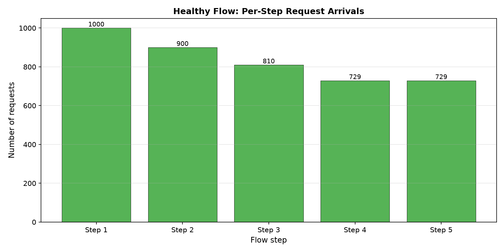

We start with 1,000 requests at Step 1 and count how many reach each later step. With 90% success per step, the numbers fall off gradually: Step 1 → 1,000, Step 2 → 900, Step 3 → 810, Step 4 → 729, Step 5 (success) → 729.

#### 1.2 Arrivals per step – broken step

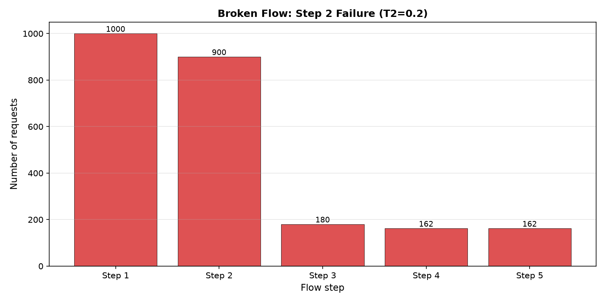

Same starting volume, but $T_2$ (Step 2 → Step 3) drops to 20%. Step 3 onward sees far fewer requests: the "cliff" sits between Step 2 and Step 3 and persists through the rest of the flow.

#### 1.3 Side-by-side comparison

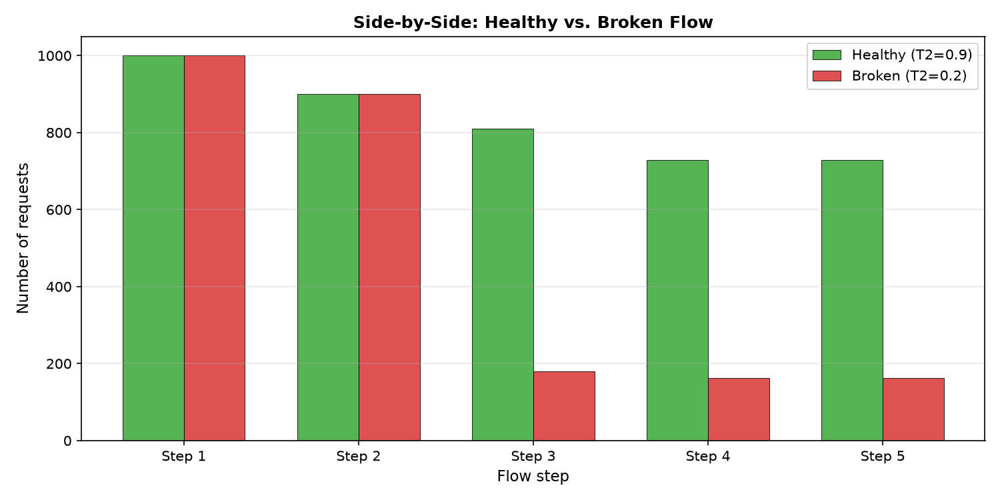

Comparing both scenarios makes the broken step obvious. This is what you'd investigate when $C(t)$ drops: which $A_i(t)$ shows the biggest change?

#### 1.4 Transition ratios

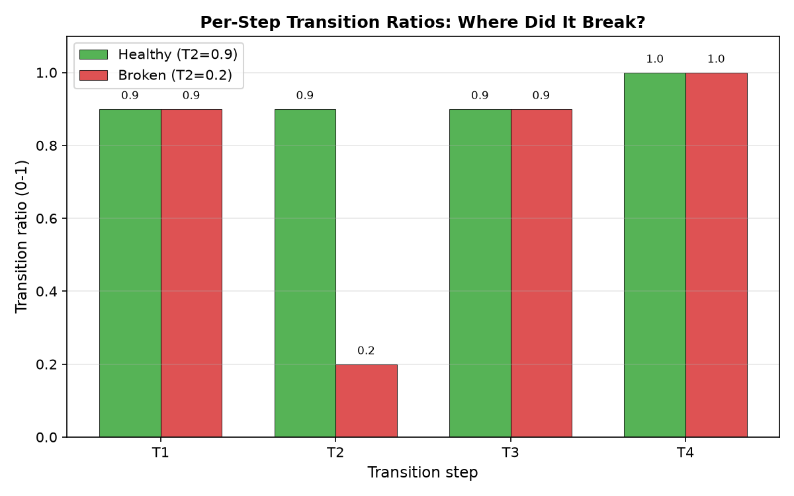

The per-step view: all transitions look healthy except $T_2$, which is exactly where the flow broke.

#### 1.5 End-to-end conversion

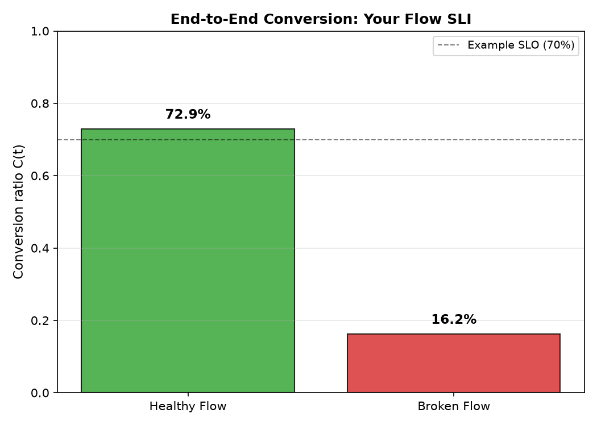

The single number you'd track as your flow SLI: 73% healthy → 16% broken. This is what triggers your alert.

---

### Part 2: Volume matters—sampling noise vs. signal

**How does traffic volume affect detection?**

All control limits in Parts 2–4 are individuals-chart limits: mean ± 3σ, with σ estimated from the average moving range of the baseline windows.

#### 2.1 Low volume: 100 requests/window

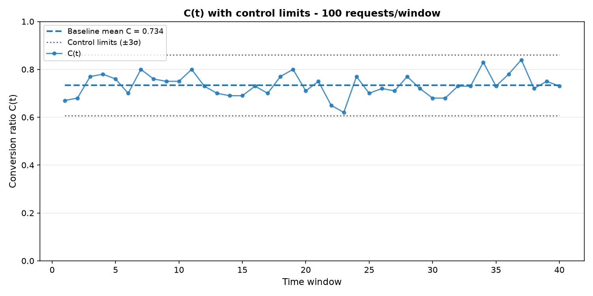

100 requests per window shows noticeable bounce (sampling noise, σ ≈ 0.04). Control limits need to be wide: about ±0.13.

#### 2.2 Medium volume: 10k requests/window

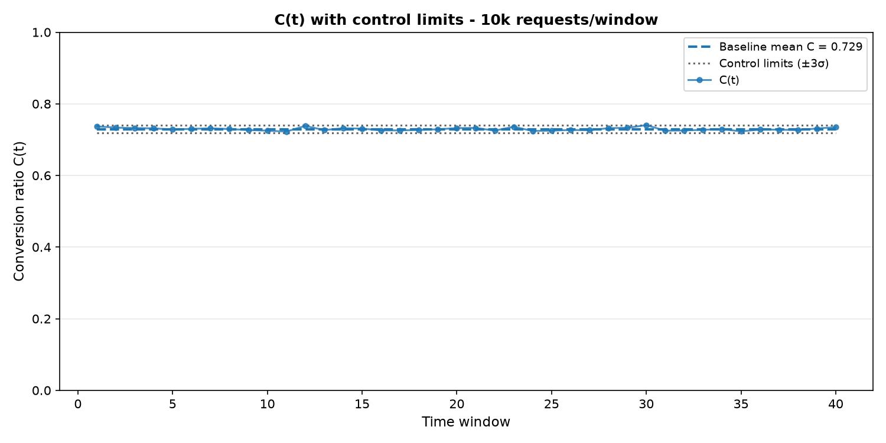

10k requests: much smoother, tighter limits (about ±0.01). Good operating range for most production flows.

#### 2.3 High volume: 1M requests/window

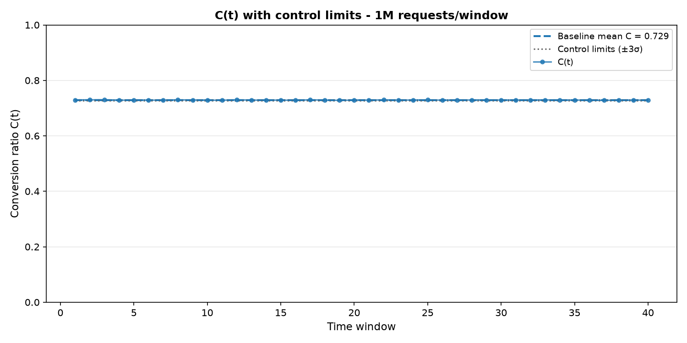

1M requests: nearly flat (limits about ±0.001). Even tiny degradations are obvious.

Sampling noise shrinks with $1/\sqrt{n}$: 100× the traffic gives 10× tighter limits.

---

### Part 3: Real-world variability—jitter

Production systems have real variation: performance fluctuations, time-of-day effects, load changes. We model this as **jitter**: in each window, each $T_i$ is drawn uniformly from $T_i ± 0.05$ (5 percentage points). $T_4 = 1.0$ can't go higher, so it stays fixed.

**Does higher volume eliminate this variation?**

#### 3.1 Timing noise in a single transition

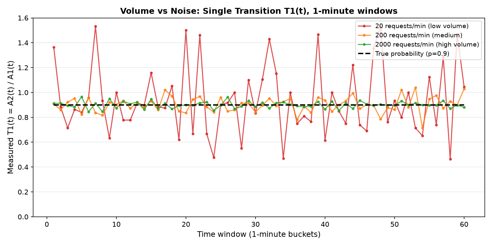

Before looking at full flows, here is a single transition $T_1(t)$ measured in 1-minute windows, where the average gap between the two steps is also 1 minute. Three volume levels (20, 200, 2000 requests/min) all have the same true success rate (90%, dashed line). At low volume the measured ratio swings from about 0.5 to 1.5.

Part of that is ordinary sampling noise. Most of it is **timing noise**: with the window as short as the gap, most step-2 requests in a window started step 1 in an earlier window. $A_1(t)$ and $A_2(t)$ are counting mostly different requests, so their random fluctuations don't cancel out. More volume or [bigger windows](#part-5-window-sizing) both fix this.

#### 3.2 Low volume with jitter

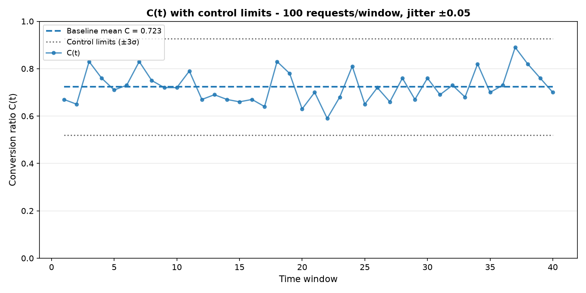

With 100 requests per window and jitter on each step, $C(t)$ varies more: σ goes from 0.04 (Part 2.1) to about 0.07. The mean stays around 73%, but individual windows range widely. Control limits have to be wide to cover this real variation.

#### 3.3 High volume with jitter—same problem persists

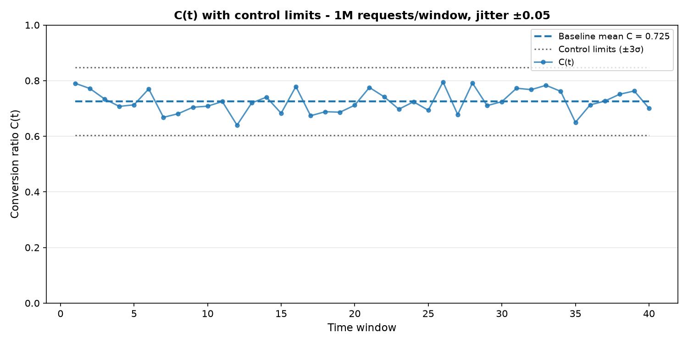

Same flow, same jitter, but with 1M requests per window. The mean is still ~73%, but **the control limits barely tighten**. Without jitter, going from 100 to 1M requests shrank the limits from ±0.13 to about ±0.001. With jitter they only shrink from about ±0.20 to ±0.12. The variation is still there because it's real: each window really does have a different success rate.

Volume reduces **sampling noise**, not **real variation**. If your system genuinely fluctuates by a few points per window, that persists at any scale.

#### 3.4 What can you do about jitter?

Options:
- **Bigger windows**: 15-30 min instead of 5 min (slower detection)
- **Moving averages**: smooth the signal (adds lag)
- **Wider thresholds**: require sustained degradation to alert
- **Fix the source**: improve system stability (best long-term)

#### 3.5 Moving average control limits

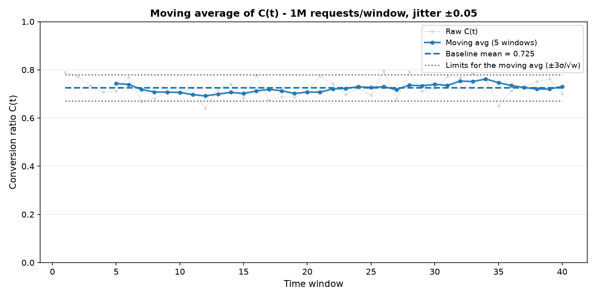

Same scenario as 3.3, but we alert on a 5-window moving average (blue) instead of raw values (gray). The average of $w$ windows has $\sqrt{w}$ times less variation, so its limits are $\sqrt{5} ≈ 2.2×$ tighter: about ±0.055 instead of ±0.12. A smaller sustained drop is now enough to cross them.

Compute σ from the **raw** values and divide by $\sqrt{w}$. Don't compute it from the moving ranges of the average itself: neighbouring averages share 4 of their 5 inputs, so they barely move from one window to the next, and the limits come out far too tight and fire on healthy traffic.

The cost is lag. A 5-window average reacts to a sudden drop with about 2 windows of delay on average, and shows the full drop only after 5 windows (50 minutes with 10-minute windows).

---

### Part 4: Detecting real failures

After 40 healthy windows, we inject a failure from window 41: $T_2$ drops from 0.9 to 0.8.

#### 4.1 Low volume: 100 requests

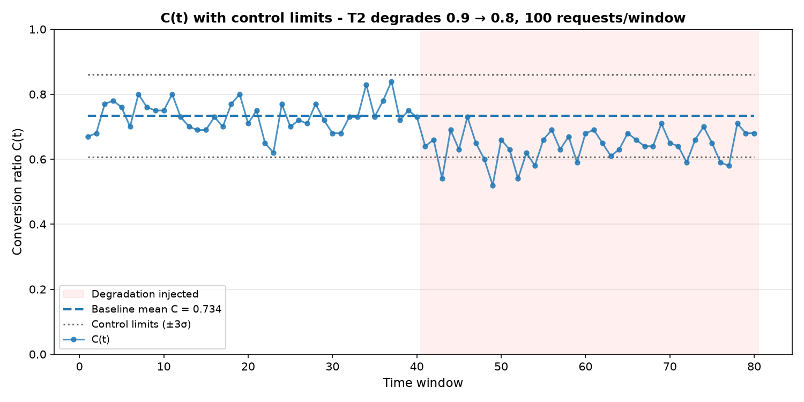

Detectable but noisy. You'd want multiple bad windows before alerting.

#### 4.2 High volume: 1M requests

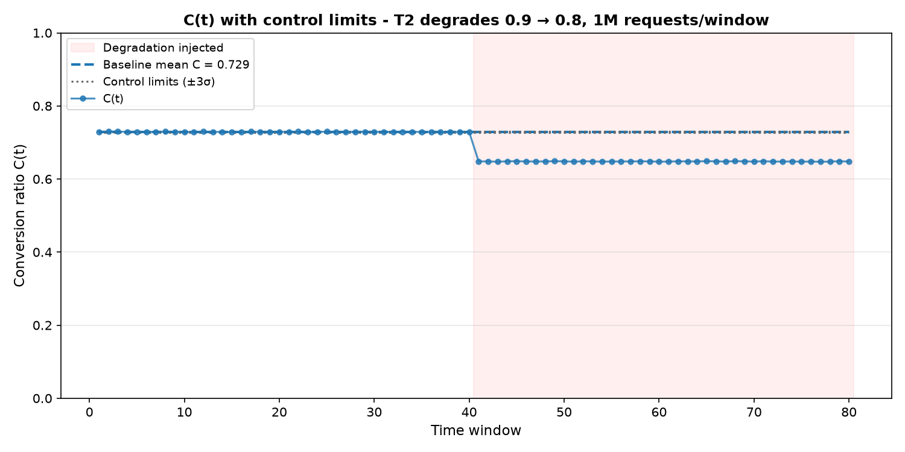

Immediately obvious. Every post-failure window would trigger.

Failures are detectable at any volume, but high volume makes detection cleaner.

---

### Part 5: Window sizing

The most common mistake is a window that is too small for the flow. The ratios still work, but they get noisy, and they mislead whenever traffic changes.

#### 5.1 Why window size matters

Each window counts whatever arrives in it. A request that enters step $i$ just before a window boundary reaches step $i+1$ in the next window. On average, the share of $A_{i+1}(t)$ that started in an earlier window is about

$$\text{spillover} ≈ \frac{\text{average gap between step } i \text{ and step } i+1}{W}$$

where $W$ is the window length. With a 1-minute average gap, that's about 20% for a 5-minute window, and about 7% for 15 minutes.

With steady traffic, spillover into a window is balanced by spillover out of it, so $T_i(t)$ is still correct on average. It's just noisier, because $A_i(t)$ and $A_{i+1}(t)$ share fewer requests (Part 3.1).

With changing traffic, step $i+1$ sees the traffic of one gap ago. When traffic rises, $T_i(t)$ reads low; when it falls, $T_i(t)$ reads high, even above 1. The bigger the spillover, the bigger the error.

It's Little's Law: at any moment, about (arrival rate × average gap) journeys are between two steps. The window has to be long enough that this in-flight group is a small part of what it counts.

#### 5.2 What a too-small window looks like

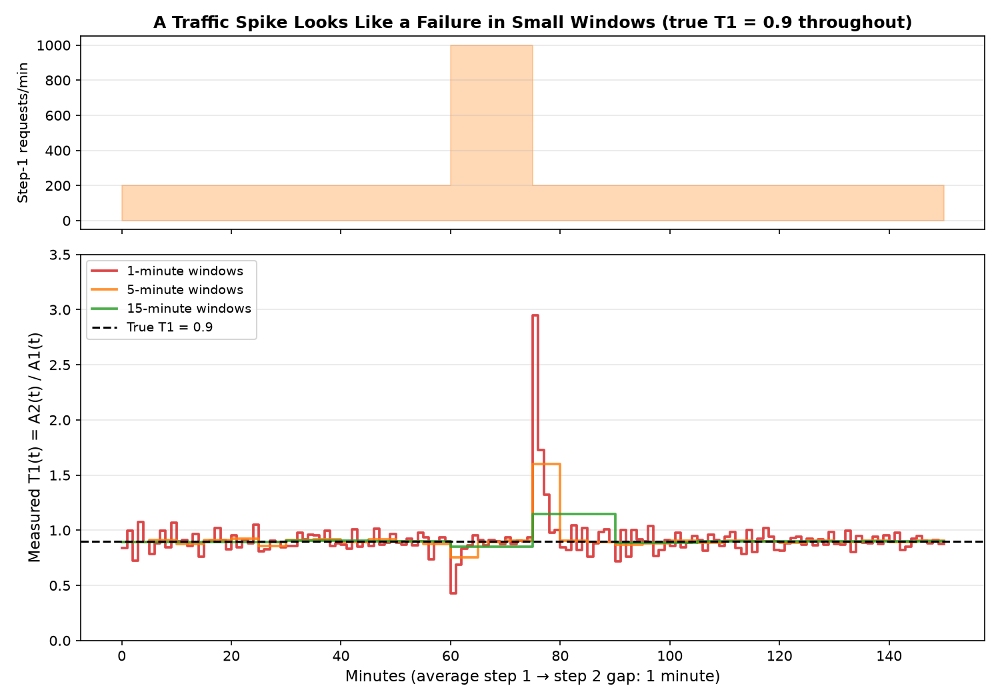

Nothing is broken here: true $T_1$ is 0.9 throughout. For 15 minutes, step-1 traffic jumps from 200 to 1,000 requests/min (a marketing push, a batch of devices, a bot wave). The average gap between the steps is 1 minute.
- 1-minute windows: $T_1$ dips to about 0.45 as the spike starts (step 1 sees the new traffic first), then jumps to about 3 as it ends (step 2 is still draining the spike while step 1 is back to normal). That looks like a failure and then a recovery above 100%.
- 5-minute windows: the same shape, but smaller: about 0.75, then 1.6.
- 15-minute windows: much smaller: about 0.85, then 1.15.

Signs that your window is too small:
- $T_i(t)$ regularly above 1
- Dips in $T_i(t)$ that line up with rises in $A_1(t)$, and bumps that line up with falls
- A noisy $T_i(t)$ even at high volume, while the same ratio over a larger window is smooth

If per-step counts differ by orders of magnitude (say 1,000 at step 1 and 500,000 at step 2), that is not a window problem. More likely you're counting something else: polling requests, a missing status filter, or an endpoint shared with another flow.

#### 5.3 How to choose window size

As a rule of thumb, make the window **5–10× the average gap between consecutive steps**, which keeps spillover around 10–20%.
- For each $T_i(t)$, use the gap between step $i$ and step $i+1$.
- For $C(t)$, use the average time of the **whole journey**, from step 1 to success, because $C(t)$ compares the first and last steps directly.

If the gaps have a long tail, the average overstates spillover: a user slower than the window can only spill into the next window once. Size the window from the bulk of journeys (for example the median plus a margin) rather than from the tail.

**Example: OAuth2 device flow** (the [real-world example](#real-world-example-oauth2-device-authorization-grant) below)

Break the flow down by step:
- Step 1→2: user opens a browser after seeing the device code (average ~1 minute, p95 ~3 minutes)
- Step 2→3: user types the code and authorizes (~30 seconds)
- Step 3→4: device polls and gets the token (a few seconds, one polling interval)
- Step 4→5: device uses the token for an API call (seconds)

The whole journey averages about 1.5–2 minutes. Using the 5–10× rule:
- 1-minute window: too small. With the window as short as the gap, the formula above breaks down; for this gap distribution, about 60% of step-2 requests started in an earlier window.
- 5-minute window: fine for $T_2$–$T_4$, which have short gaps. Borderline for $T_1$ (about 20% spillover) and $C(t)$ (30–40%), which shows up as noise and as errors during traffic ramps.
- 10–15-minute window: good for $T_1$ and $C(t)$. This is what the example below uses.

You can also use different windows per ratio: short windows for fast inner steps, longer for $T_1$ and $C(t)$.

#### 5.4 How to validate

Plot $T_i(t)$ at two window sizes (say 5 and 15 minutes) over a day with a traffic ramp. If the smaller window shows dips during ramp-ups, bumps during ramp-downs, or values above 1 that the larger one doesn't, the smaller window is too small.

For flows with long or variable gaps (email verification over hours, human review, async jobs), a window long enough to contain the journey makes this a slow, laggy signal. Use event-based funnels instead (see [events.md](events.md)).

---

## Real-world example: OAuth2 Device Authorization Grant

Let's apply this to a real authentication flow: the OAuth2 Device Authorization Grant ([RFC 8628](https://datatracker.ietf.org/doc/html/rfc8628), the "device flow"), used by smart TVs, CLI tools, and IoT devices.

### The flow

**Step 1**: Device requests a device code  
→ `POST /device_authorization` returns `device_code` and `user_code`

**Step 2**: User visits the verification URL  
→ User opens a browser and navigates to the `verification_uri`

**Step 3**: User enters the code and authorizes  
→ User types the `user_code`, reviews permissions, grants access

**Step 4**: Device polling succeeds  
→ Device polls `POST /token` and receives valid tokens

**Step 5 (success)**: Device has a working access token  
→ First API call with the token succeeds

### Metrics for a 10-minute window

For each window $t$, we count **requests** at each step (10 minutes follows [the rule above](#53-how-to-choose-window-size)):
- $A_1(t)$: number of `POST /device_authorization` requests
- $A_2(t)$: number of verification page GET requests (HTTP 200)
- $A_3(t)$: number of successful authorization POST requests (consent granted)
- $A_4(t)$: number of `POST /token` requests that return valid tokens (HTTP 200 with token). Pending polls (`authorization_pending`) are not counted, or they would swamp this step.
- $A_5(t)$: number of requests to protected resources that succeed with these tokens

Transitions:
- $T_1(t) = A_2(t)/A_1(t)$: verification page loads per device auth request
- $T_2(t) = A_3(t)/A_2(t)$: successful authorizations per verification page load
- $T_3(t) = A_4(t)/A_3(t)$: token retrievals per authorization grant
- $T_4(t) = A_5(t)/A_4(t)$: successful API calls per token retrieval

End-to-end conversion:
$$C(t) = \frac{A_5(t)}{A_1(t)} = T_1(t) \cdot T_2(t) \cdot T_3(t) \cdot T_4(t)$$

A user who restarts the flow generates another device auth request, so retries show up in $A_1(t)$ and lower $C(t)$. This measures "what fraction of requests successfully progress", not a per-user completion rate over unbounded time.

### Typical healthy values

- $T_1 \approx 0.95$ (most device auth requests lead to verification page loads)
- $T_2 \approx 0.85$ (some verification page loads don't result in authorization completion)
- $T_3 \approx 0.98$ (authorization grants reliably lead to token retrieval)
- $T_4 \approx 0.99$ (tokens usually work for API calls)
- Overall $C \approx 0.78$ (~78% of device auth requests result in successful API calls)

### What this catches

If $T_2$ drops from 0.85 to 0.70:
- Per-endpoint monitoring shows all endpoints returning HTTP 200
- But $C$ drops from $0.95 \times 0.85 \times 0.98 \times 0.99 = 0.78$ to $0.95 \times 0.70 \times 0.98 \times 0.99 = 0.65$ (65%)
- This signals that fewer requests are completing the flow, even though each individual endpoint succeeds

This catches issues like broken verification URLs, confusing UX, or timing problems that per-endpoint success rates miss.

### Scenarios

The scenarios below show how different kinds of change affect the flow metrics. Each window has 10k device auth requests unless the traffic follows a daily cycle, and each $T_i$ jitters by ±0.02 (narrowed near 1, so $T_4 = 0.99$ only jitters by ±0.01). Degradations start at window 21, after 20 healthy windows.
- Scenarios 1, 4 and 5 alert on a 5-window moving average, with limits computed as in [Part 3.5](#35-moving-average-control-limits).
- Scenarios 2 and 3 have a daily traffic cycle and use **volume-aware limits**: a p-chart, whose limits depend on each window's volume, plus the real variation measured in the healthy baseline.

#### Scenario 0: Volume independence

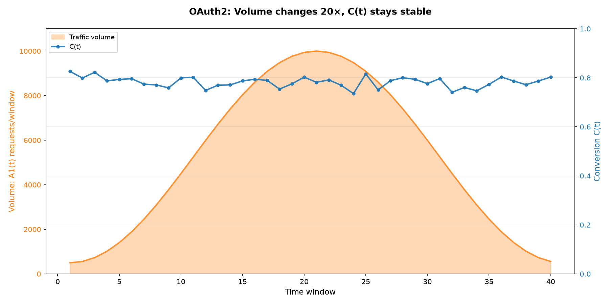

Traffic varies 20× (500→10k→500 req/window), yet $C(t)$ stays ~78%. Volume affects **noise**, not **signal**—this is why ratios work across scales.

#### Scenario 1: User behavior change — T1 drops

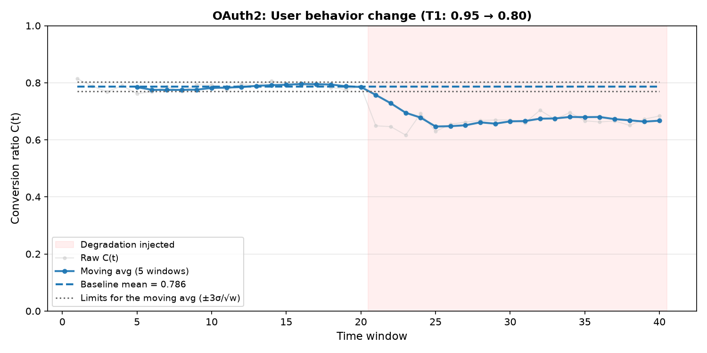

$T_1$ drops from 0.95 to 0.80 at window 21. Likely a UX issue (broken link, confusing instructions). The moving average crosses the lower limit in the first bad window and settles around 66%.

#### Scenario 2: System failure with seasonal traffic — T2 drops

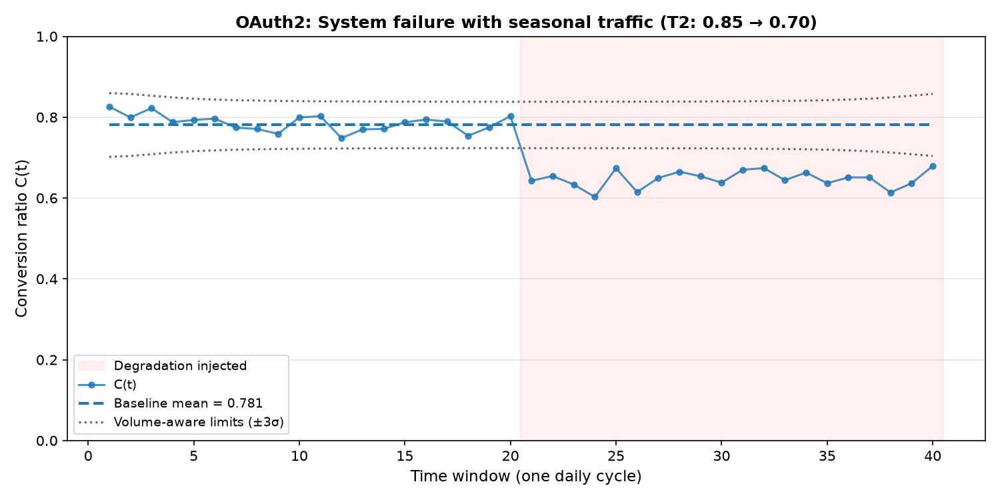

Daily traffic pattern with $T_2$ degrading at window 21. The limits are fixed from the healthy baseline, so every bad window stays below them. Limits recomputed from a rolling window would slowly absorb the failure and the alert would clear itself.

#### Scenario 3: Seasonal pattern — healthy flow

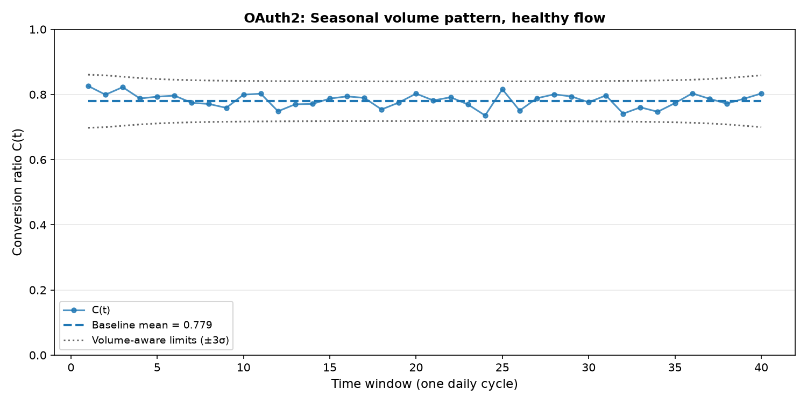

Daily cycle, healthy throughout. The limits widen at night (about ±0.08 at 500 requests/window) and tighten at peak (about ±0.06 at 10k). At peak (10k requests), sampling noise (σ ≈ 0.004) is small next to the real variation from the ±0.02 jitter per step (σ ≈ 0.02), so the jitter sets the width. At night (500 requests) the two are about equal, which is why the limits widen by about a third, not more. As in Part 3, past a certain volume more traffic stops tightening the limits.

#### Scenario 4: Polling failure — T3 drops

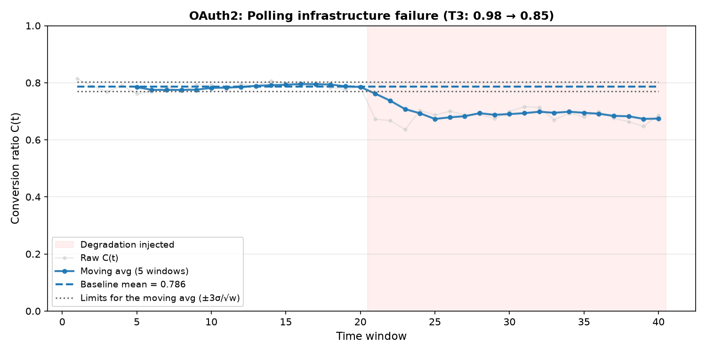

$T_3$ drops from 0.98 to 0.85. Polling timeouts or rate limiting.

#### Scenario 5: Token validation — T4 drops

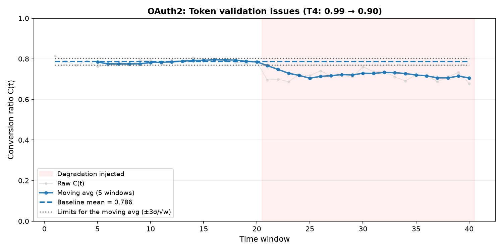

$T_4$ drops from 0.99 to 0.90. Tokens issued but fail on API calls.

---

## Advanced notes (optional)

Notes for rolling this out in production.

**Volume, variance, and windows**
- Ratios are mathematically volume-agnostic, but sampling noise shrinks with more traffic. Real variation does not ([Part 3](#part-3-real-world-variabilityjitter)).
- With very low arrivals per window, $T_i(t)$ and $C(t)$ are noisy. Use larger windows, require multiple bad windows before paging, or use a different tool (funnels, events).
- Window size: see [Part 5](#part-5-window-sizing).

**Control charts**
- Individuals chart: simple, works when volume per window is roughly stable.
- P‑chart: limits widen at low volume and tighten at high volume. On its own it assumes sampling noise is the only noise, so at high volume it fires on normal jitter. Add the real variation from a healthy baseline (Scenario 3, or a Laney p′ chart).
- Keep limits fixed from a known-good period and update them occasionally as the system evolves. Limits recomputed continuously from recent data drift towards an ongoing failure.
- Instead of control charts, you can use simple alert rules (for example static SLO-style thresholds on $C(t)$) or the built-in anomaly detection / forecasting in your metrics backend, with the same $T_i(t)$ and $C(t)$ as inputs. [alerts.md](alerts.md#threshold-patterns-by-metric-type) shows how to set one for journey conversion.

**Non-linear flows**
- In practice each major branch is its own mostly sequential flow, tagged `flow=<journey>_<method>` (for example `flow=login_password`, `flow=login_sso`, `flow=login_webauthn`).
- For loops and retries, you can usually treat retries as extra noise in $A_i(t)$ and $T_i(t)$; with enough traffic they average out and a retry storm will show up as a drop in $C(t)$. Split out first attempts vs retries only if you need to distinguish "hard failures" from "eventual success after many retries".

**SLIs, SLOs, and cost**
- Typical stack: per-endpoint availability + latency **and** flow conversion $C(t)$.
- A practical flow SLI is the volume-weighted mean conversion over a period $P$: $\text{SLI}_\text{flow}(P) = \frac{\sum_t A_1(t)\,C(t)}{\sum_t A_1(t)} = \frac{\sum_t A_S(t)}{\sum_t A_1(t)}$. Under the assumptions above, this approximates the fraction of attempts that eventually succeed.
- The SLO is the target on top of it, for example "SLI ≥ 75% over 30 days". [flows.md](flows.md#41-what-these-metrics-tell-you) shows a window-based alternative ("99% of windows above X").
- Per-step SLOs locate the broken component; end-to-end conversion SLOs say whether the journey works.
- A small, controlled `flow` tag adds predictable metric cardinality and is usually cheap in managed backends ([dashboards.md](dashboards.md#tagging-and-cardinality)).

**Traffic mix, bots, and abuse**
- Not all arrivals are equal: some traffic comes from real users, some from automated clients, some from abusive sources. All of it contributes to $A_i(t)$, $T_i(t)$, and $C(t)$.
- If the mix is **stable**, its effect is baked into your baseline and limits.
- When abuse/bot traffic surges, you often see $A_1(t)$ spike and transitions drop.

## Other applications of this method

- **API rate limiting and retry policies**: track end-to-end success including retries; detect when rate limits are too aggressive or retries mask degradation.
- **Payment processing flows**: measure checkout-to-settlement conversion; catch revenue leaks where per-endpoint metrics show success but customers don't complete payment.
- **CI/CD pipelines**: reveal the real deployment success rate. Five stages at 98% each give only 90% end-to-end.
- **Data ingestion pipelines**: detect when data arrives but doesn't fully propagate through validation, transformation, and caching.
- **Service mesh / distributed systems**: catch cross-service conversion drops that per-service SLIs miss due to cascading timeouts or retries.
- **Email delivery pipelines**: measure accepted → delivered, beyond "accepted by SMTP"; detect ISP blocking and spam filtering. This works when the stages complete within minutes, not when you're waiting on a human to open the email.

## Existing approaches and alternatives

This builds on **Google SRE's journey-based SLIs** ([SRE Workbook](https://sre.google/workbook/implementing-slos/#modeling-user-journeys)) and **Statistical Process Control** from manufacturing. Not reinventing anything—just tying together journey SLIs, SPC, and standard metrics backends, with concrete math and guidance.

### Comparison with existing tools

| Approach | How it works | What it is best at | Main tradeoffs |
|---|---|---|---|
| Real User Monitoring / Funnels | Client events per user/session, queried as funnels | Product analytics, paths, cohorts, UX questions | Needs identity, higher cost, awkward for SLOs |
| Synthetic monitoring | Bots run scripted journeys | Smoke tests, external checks, third parties | Fake traffic, limited scenarios, no load info |
| APM / distributed tracing | Per-request traces across services | Deep debugging of specific failures | High cardinality, sampling, complex queries |
| High-cardinality observability ([events.md](events.md)) | Stores rich, high-cardinality events and fields | Ad-hoc "show me all requests where…" queries | Cost grows with cardinality and usage |
| This **Journey Metrics** model | Aggregate request counters per step and time window | Cheap, simple flow SLIs and SLOs | Less flexible for arbitrary ad-hoc questions |

**When to use what:**
- **RUM/Funnels**: Product analytics, user segmentation
- **Synthetic monitoring**: Smoke tests, uptime checks
- **APM/Tracing**: Debugging specific failures
- **High-cardinality**: Exploratory analysis
- **Journey Metrics**: Cheap flow SLOs and alerts

---

## Refresh visualizations

Requires [uv](https://docs.astral.sh/uv/). From the repo root:

```sh
uv run src/metrics_demo.py
```

On the first run, uv creates `.venv` and installs the dependencies from `pyproject.toml` (numpy, matplotlib; Python 3.10+). The plots are written to `images/`. Every plot is seeded, so reruns produce identical images.
