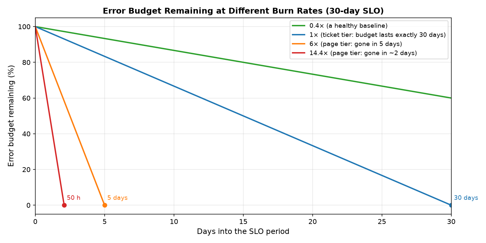
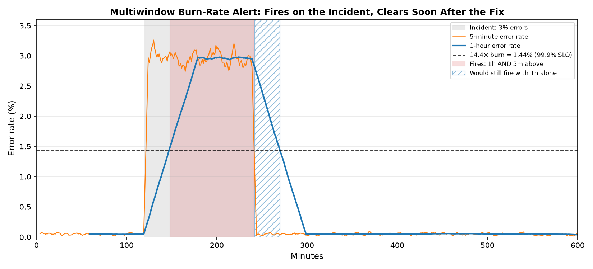
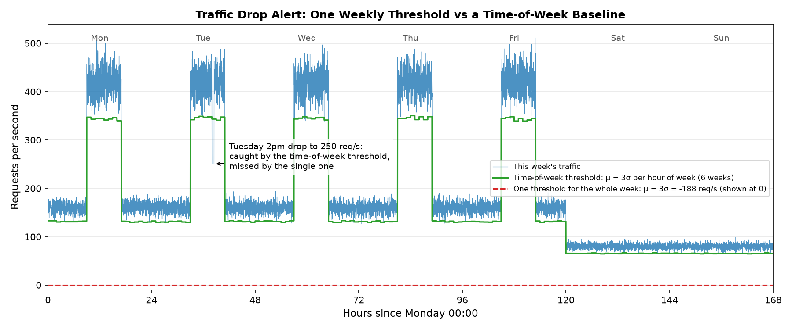
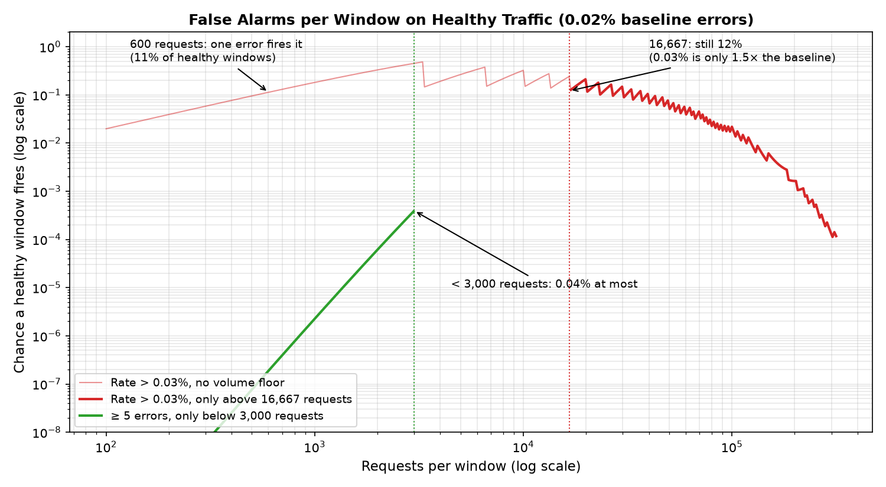

# Alerts: what to page on, and how to set thresholds

What deserves a page, and which thresholds catch real problems without paging on noise? Examples are Prometheus rules with illustrative metric names; the logic fits any backend. Numbers: `uv run src/calc.py burn --slo 99.9`, `poisson`, `wilson` ([analysis.md](analysis.md#formulas)).

## Rules

1. **Page only on symptoms users feel, with an action**, because causes need work, not a 3 am wake-up ([why](#what-to-page-on)).
2. **Burn-rate alerts need a long and a short window**, because the long one shows it matters and the short one clears after the fix ([why](#slo-burn-rate-alerts)).
3. **Use time-of-week baselines for traffic**, because one μ − 3σ over the week never fires ([why](#traffic-volume)).
4. **Set capacity thresholds from load tests, per instance**, because μ + 3σ lands past degradation ([why](#threshold-patterns-by-metric-type)).
5. **At low traffic, require a volume floor or alert on counts**, because one error is a large error rate ([why](#low-traffic)).
6. **Require the condition to hold** (`for:` or two windows), because per-minute checks multiply false alarms ([why](#durations-windows-and-false-alarms)).
7. **Treat zero traffic as "no data"**, because `errors / max(requests, 1)` reads 0% during an outage ([why](#durations-windows-and-false-alarms)).
8. **Set the SLO target from what you've measured**, because a target above it uses up the budget in normal weeks ([why](#choosing-the-slo-target)).
9. **Review every page monthly**, because the people paged are the people building; a page that needed no action becomes a ticket or goes ([why](#reviewing-alerts)).

## What to page on

| Signal | Action | Why |
|---|---|---|
| **Symptoms users feel** | Page | Users are affected now |
| **Causes and slow risks** | Ticket | Needs work, not a 3 am wake-up |
| **Everything else** | Dashboard | Explains alerts; rarely needs to wake anyone |

- **Symptoms users feel**: key action and API call error rates and latency (level 2, [kpis.md](kpis.md#the-kpi-tree)), via SLO burn rates.
- **Causes and slow risks**: saturation, capacity trends, a degrading dependency, slow budget burn.
- **Everything else**: includes most resource metrics.
- "Watch it" isn't an action → ticket.

## SLO burn-rate alerts

| Term | Definition | Example |
|---|---|---|
| **SLO period** | 30 days | |
| **Error budget** | (1 − SLO target) × requests in the period | 99.9% SLO → 0.1% of the period's requests may fail |
| **Burn rate** | Observed error rate / (1 − SLO target); 1× = the budget lasts exactly 30 days | 0.5% errors against a 99.9% SLO = 5× → budget gone in 6 days |

The SRE Workbook's multiwindow, multi-burn-rate alerts:

| Severity | Long window | Short window | Burn rate | Budget used in long window | Budget gone in |
|---|---|---|---|---|---|
| Page | 1h | 5m | 14.4× | 2% | ~2 days |
| Page | 6h | 30m | 6× | 5% | 5 days |
| Ticket | 3d | 6h | 1× | 10% | 30 days |

<figure><figcaption><p>At 14.4× the budget is gone in 50 hours, at 6× in 5 days, at 1× exactly at the end of the period.</p></figcaption></figure>

Fire only when **both** windows exceed the burn rate. The short window is 1/12 of the long one.

<figure><figcaption><p>Simulated 2-hour incident at 3% errors (99.9% SLO). The pair fires 28 minutes in, when the 1-hour rate crosses 1.44%, and clears 2 minutes after the fix. With the 1-hour window alone it would fire 30 minutes longer (hatched).</p></figcaption></figure>

- Error-rate threshold = burn rate × (1 − target):
  - 99.9% SLO: 1.44%, 0.6%, 0.1%
  - 99.95% SLO: 0.72%, 0.30%, 0.05%
- **Latency SLOs**: SLI = fraction of requests faster than a threshold (e.g. 500 ms). Alert on the burn rate of the slower fraction the same way.
- **Count requests, not bad minutes.** A time-slice SLO (share of good minutes) weighs a quiet minute like a busy one.
- **Shorter long window**: if the tool can't look back 3 days, keep the share of budget: burn rate = budget share × SLO period / window, so 10% in 24 h is 3× (`calc.py burn --ticket-hours 24`).
- **SLI source**: counters taken before sampling, as in the example below, or a query over events with each one weighted by its sample rate. Weighted counts are estimates, so prefer counters at low traffic ([events.md](events.md#trade-offs)).

```yaml
groups:
  - name: api-slo
    rules:
      - record: api:error_ratio:rate5m
        expr: |
          sum(rate(http_requests_total{service="api",code=~"5.."}[5m]))
            / sum(rate(http_requests_total{service="api"}[5m]))
      # ...the same for 30m, 1h, 6h, 3d

      - alert: ErrorBudgetFastBurn        # SLO 99.9% → budget 0.001
        expr: |
          (api:error_ratio:rate1h > 14.4 * 0.001 and api:error_ratio:rate5m > 14.4 * 0.001)
          or
          (api:error_ratio:rate6h > 6 * 0.001 and api:error_ratio:rate30m > 6 * 0.001)
        labels: { severity: page }

      - alert: ErrorBudgetSlowBurn
        expr: api:error_ratio:rate3d > 0.001 and api:error_ratio:rate6h > 0.001
        labels: { severity: ticket }
```

The example counts server-side 5xx for brevity; prefer client or edge counts, which also include timeouts and network failures ([kpis.md](kpis.md#measure-where-the-user-is)).

For a key action's SLO, select its critical-path calls, e.g. with a `key_action="save_document"` label ([kpis.md](kpis.md#map-it)).

## Choosing the SLO target

One target per key action, on its SLI as the user sees it ([kpis.md](kpis.md#measure-where-the-user-is)).

- **Measure first**: the error rate per week over the last 4–8 weeks. The spread between weeks sets your margin ([real variation](analysis.md#sampling-noise-vs-real-variation)); `calc.py wilson` only for weeks with few attempts.
- **Set it below the worst normal week, with room for incidents**: check the 1× ticket wouldn't have fired in those weeks. No history yet → page on the [conservative thresholds below](#if-you-have-no-baseline-yet) instead, and measure.
- **Tighten it only when users need it**: each extra nine cuts the budget tenfold and raises the volume floor tenfold (`calc.py burn --slo 99.99`: 3,473 requests per 5 minutes), so quiet services stop paging.
- A key action others depend on (log in) can't have a looser target than theirs.

## Threshold patterns by metric type

| Metric | Approach | Example |
|---|---|---|
| **Error rate** | Burn rate on the SLO ([above](#slo-burn-rate-alerts)) | 14.4× over 1h and 5m |
| **Latency** | Burn rate on "fraction slower than X"; or a percentile threshold from histograms, sustained | `histogram_quantile(0.95, …) > 0.2` for 10m |
| **Traffic volume** | Time-of-week baseline μ(hour, day) − 3σ(hour, day), drops lasting 5m ([below](#traffic-volume)) | Normal Tuesday 2pm 420 req/s, σ 25 → alert below 345 |
| **Capacity** | Load-tested limits, per instance | CPU warn 70%, critical 80%; pool warn 75%, critical 90% |
| **Rare events** | Any occurrence, on the counter's increase | `increase(disk_errors_total[10m]) > 0` |
| **Dependencies** | Their SLA plus a margin, sustained | Vendor p95 SLA 800 ms → alert above 1 s for 10m |

Pitfalls:

- **Error rate**: one error crosses it at [low traffic](#low-traffic).
- **Latency**: never mean + 3σ, because latency is skewed. A threshold close to the normal p95 flaps.
- **Traffic volume** (attempts of each key action, or requests per service): one μ and σ over all hours of the week never fires.
- **Capacity** (CPU, memory, pools): μ + 3σ often lands past the point where things degrade. Averaging instances hides one hot instance.
- **Rare events**: `counter > 0` stays true forever after the first event. `increase()` misses the first event when the series first appears at 1: initialise counters at 0.
- **Dependencies**: don't page on a vendor's normal p99.

### Traffic volume

- Compute μ and σ for each hour of the week from 4–8 weeks of history.
- Use every minute in each bucket, not one value per week, so σ has enough samples.
- One μ and σ for all hours fails: with strong daily and weekly swings, σ exceeds μ/3, so μ − 3σ is below zero.

<figure><figcaption><p>One μ − 3σ over the whole week (μ 199, σ 129) comes out at −188 req/s and can never fire. The time-of-week band, from 6 earlier weeks, sits at about 343 req/s on Tuesday at 2pm and catches the drop to 250. The simulated noise is independent minute to minute, with no week-to-week level shifts, so this band is tighter than real history would give; include real level shifts in yours.</p></figcaption></figure>

### Static vs dynamic thresholds

- Dynamic (rolling baselines) adapt to growth, but a degraded week becomes the new normal ([analysis.md](analysis.md#baselines-and-seasonality)), and they're harder to debug. Never let one rise above the load-tested limit. A vendor's anomaly detection trained on recent history is a rolling baseline too.
- Capacity: prefer static thresholds.
- Ratios without an SLO: fixed control limits from a known-good period, updated deliberately.

## Low traffic

At 600 requests per window, one error = 0.17%. Two fixes: require enough volume, or alert on counts.

### Require enough volume

Set the floor so the threshold means several errors:

- Minimum requests per evaluation window ≈ 5 / threshold rate (at 0.03% → ~17,000). For a burn-rate pair, apply it to the short window (5m or 30m); `calc.py burn` prints it per pair.
- State when that floor silences the rule (often nights, weekends) and what covers those hours.
- Leave headroom: a threshold close to the baseline still fires by chance. At a 0.02% baseline, a 0.03% threshold (1.5×) trips ~12% of healthy 17,000-request windows, and below 1% only from ~120,000 requests.

### Alert on counts, gated to low traffic

Use this where the expected count is far below the threshold:

```yaml
- alert: ErrorsLowTraffic
  expr: |
    sum(increase(http_requests_total{service="api",code=~"5.."}[5m])) >= 5
    and
    sum(increase(http_requests_total{service="api",code=~"5.."}[15m])) >= 10
    and
    sum(increase(http_requests_total{service="api"}[5m])) < 3000
  labels: { severity: warning }
```

- Safe because at a 0.02% baseline and < 3,000 requests per 5 minutes, a window expects ≤ 0.6 errors; 5 or more happen by chance < 0.04% of the time ([Poisson](analysis.md#formulas)).
- Without the traffic gate it fires all day at normal traffic.

<figure><figcaption><p>On healthy traffic (0.02% errors): the rate threshold fires on single errors at low volume (11% of 600-request windows) and still ~12% of the time at its 16,667-request floor. The count rule stays below 0.04% up to its 3,000-request gate, partly because it's less sensitive (5 errors in 3,000 requests is 0.17%, over 8× the baseline). The curve covers the 5-minute condition; the 15-minute one lowers it further. The sawtooth comes from rounding the threshold to whole errors.</p></figcaption></figure>

## Durations, windows and false alarms

- **False alarms per day** ≈ false-positive rate per evaluation × evaluations per day.
  - One-sided 3σ on normal data trips 0.13% of the time ([analysis.md](analysis.md#sigma-thresholds-and-what-they-promise)); checked every minute → ~2 false alarms a day.
- **Window ≥ 3–5× the period of the noise**: 30 s fluctuations → 1.5–2.5 min window.
- **`for:` duration by failure speed**: fast, severe → short (pool exhaustion: 1m); slow → longer (CPU warning: 15m).



**Zero traffic**: a ratio over no requests is no data, not 0% ([pitfalls](analysis.md#pitfalls)), so an error-rate rule goes silent during an outage. Alert separately on no successful requests for 5 minutes while traffic is expected (the same window last week had traffic, or the [time-of-week baseline](#traffic-volume) is above zero).



## Root-cause (composite) alerts

When a symptom has several known causes, a composite alert can name which:

| Condition | Message |
|---|---|
| latency high **and** CPU > 70% | "CPU saturation: scale out" |
| latency high **and** DB p95 > 100 ms **and** CPU ≤ 70% | "slow queries" |
| latency high **and** third-party p95 > 1 s **and** CPU ≤ 70% **and** DB p95 ≤ 100 ms | "vendor" |

- Make conditions complementary (`> 70` vs `≤ 70`) → no gaps.
- Keep the plain symptom alert too: it fires when no known cause matches.

## Alert anatomy

```text
Alert:     [Service] – [What]
Threshold: [Current] vs [Expected]
Impact:    [Key actions / users affected]
Runbook:   [Link]
Dashboard: [Link, with the time range]
```

What the runbook contains: [incidents.md](incidents.md#what-a-runbook-contains).

## If you have no baseline yet

Temporary, conservative defaults; replace them with thresholds from 4–8 weeks of history once you have it ([analysis.md](analysis.md#sampling-noise-vs-real-variation)):

- error rate > 1%, with a [volume floor](#low-traffic)
- p99 latency > 1 s
- CPU > 80%

## Reviewing alerts

Once a month, for the pages of the last 30 days:

- **Needed a human, now?** No → make it a ticket, or delete it.
- **Missed incidents** (users noticed first): add or tune the alert that should have fired ([post-incident review](incidents.md#post-incident-review)).
- **Retune** traffic and capacity thresholds against the last 4–8 weeks, and write the date.
- **Target still right?** Loosen it only if users didn't notice the misses; tighten it only if they did.

## Checklist

- [ ] Follows the [rules](#rules)
- [ ] Percentiles from histograms, never averaged
- [ ] Accounts for daily and weekly patterns
- [ ] Tested against the last 30 days: would it have fired on past incidents, and how often on healthy days?
- [ ] Threshold reasoning written down, with the date it was last tuned

## References

- [Google SRE Workbook: Alerting on SLOs](https://sre.google/workbook/alerting-on-slos/): the burn-rate tiers above
- [Google SRE Book](https://sre.google/sre-book/table-of-contents/)
- [SRE with Java Microservices](https://www.oreilly.com/library/view/sre-with-java/9781492073918/), Jonathan Schneider (O'Reilly): chapter 4 on charting and alerting
