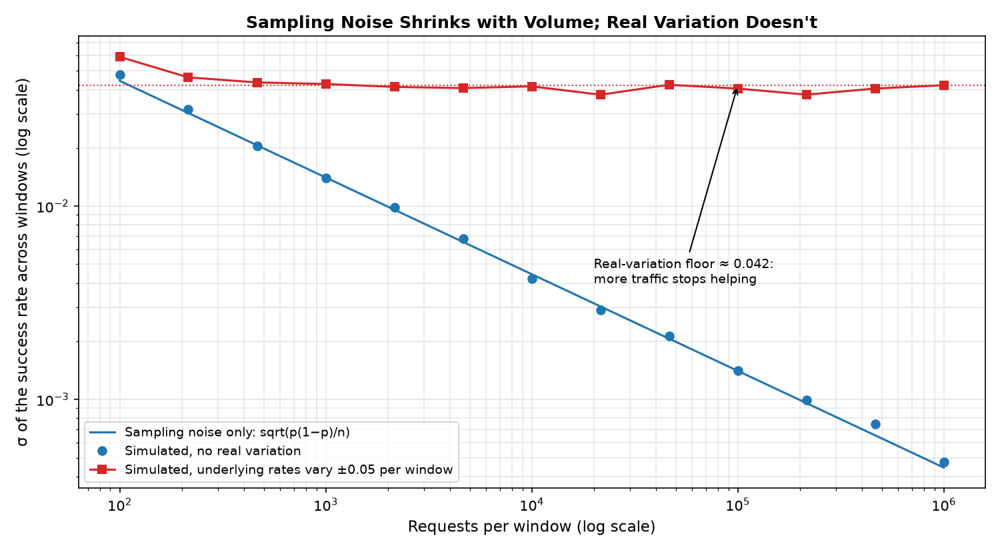
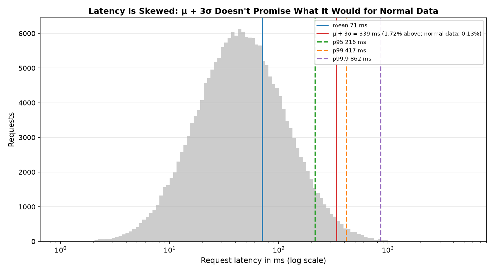
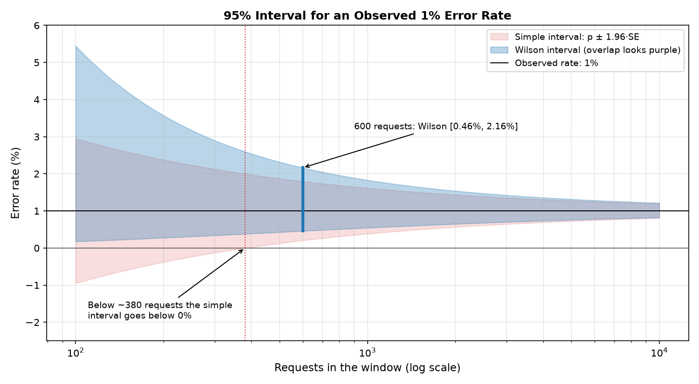
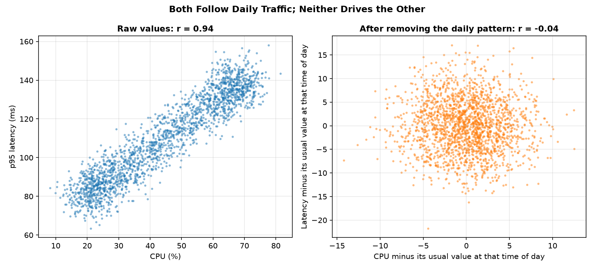

# Analysis: is this change real, and did it move the KPI?

A metric moved: is it real, what caused it, did it affect a KPI? Chapter 2; read [kpis.md](kpis.md) first. Next, [dashboards.md](dashboards.md) puts these numbers on screen.

## Rules

1. **Measure σ from healthy history**, because real variation doesn't shrink with volume; without history, sampling noise is a lower bound ([why](#sampling-noise-vs-real-variation)).
2. **Use percentiles for skewed metrics**, because μ + 3σ promises the wrong exceedance rate ([why](#sigma-thresholds-and-what-they-promise)).
3. **Use the Wilson interval at low volume**, because the simple range goes below 0% ([why](#wilson-score-interval)).
4. **Compare like with like, against a fixed reference**, because traffic changes by hour and rolling baselines absorb slow degradation ([why](#baselines-and-seasonality)).
5. **Check a control and confounders before naming a cause**, because a z-test can't tell a deploy from a mix shift ([why](#did-it-move-the-kpi-an-attribution-recipe)).
6. **Correlate on residuals or within the same hour**, because daily traffic makes unrelated metrics correlate ([why](#correlation-isnt-causation)).
7. **Compute rates from raw, unsampled counters**, because averaged averages and sampled counts mislead ([why](#pitfalls)).
8. **Report the size of a change with its interval, not only "significant"**, because at high volume almost any difference is significant, and significant doesn't mean it matters ([why](#sampling-noise-vs-real-variation)).
9. **Keep latency outliers and compare instances with each other**, because the tail is often the problem and one bad host hides in a fleet average ([why](#outliers)).

## Sampling noise vs real variation

- **Sampling noise shrinks with volume**: $$SE = \sqrt{p(1-p)/n}$$ falls as $$1/\sqrt{n}$$, so 100× the traffic → 10× less noise.
- **Real variation doesn't shrink**: performance fluctuates, traffic mix shifts, users behave differently by hour. Past some volume it dominates (more plots in the advanced [flows.md Part 3](flows.md#part-3-real-world-variability-jitter)).



One simulated success rate of about 0.73. Without real variation, σ falls as $$1/\sqrt{n}$$ (0.048 at 100 requests, 0.0005 at 1M). When the underlying rate varies ±0.05 per window, σ stays around 0.042 from ~1,000 requests on.

- **Example**: login success rate at 18,000 attempts per 5 minutes: binomial SE 0.2%, observed σ 1.5%. Limits from the SE (μ − 3 × 0.2%) fire constantly; limits from the observed σ (μ − 3 × 1.5%) don't.
- **No history?** Say so: the sampling-noise result (Wilson, z-test, Poisson) is only a lower bound. Get 4–8 weeks of the metric at the same window before setting limits.
- **Significance tests cover sampling noise only**: at high volume almost any difference is "significant".
- **"Significant at the 5% level"** = if nothing had changed, a difference this large would appear by chance < 5% of the time. **Not** a 95% probability that the change is real.
- **Smoothing** with a moving average of $$w$$ windows:
  - $$\sqrt{w}$$ times less variation; lags about $$(w-1)/2$$ windows (the full change shows after $$w$$);
  - σ for its limits = σ of the raw values ÷ $$\sqrt{w}$$. Don't estimate it from the average's own window-to-window changes: neighbouring averages share $$w - 1$$ inputs, so the estimate comes out far too small.

## Sigma thresholds and what they promise

- Normal data, one-sided: 2.3% of healthy points exceed μ + 2σ; 0.13% exceed μ + 3σ.
- Latency, error counts and traffic are usually skewed or seasonal: the real exceedance rate is far from the formula's, usually higher. Check thresholds against history.



A simulated lognormal sample (median 45 ms, mean 71 ms, σ 89 ms): μ + 3σ = 339 ms, with 1.72% of requests above it, 13× the 0.13% the formula promises for normal data.

## Wilson score interval

The simple 95% range is $$p \pm 1.96\,SE$$.



For an observed 1% rate, the simple interval goes below 0% under ~380 requests; Wilson stays positive and is wider on the high side.

```text
center = (p + z²/(2n)) / (1 + z²/n)
margin = z × sqrt(p(1−p)/n + z²/(4n²)) / (1 + z²/n)

Example: 6 errors in 600 requests (p = 1%), z = 1.96
center = (0.01 + 0.0032) / 1.0064 = 0.0131
margin = 1.96 × sqrt(0.0000165 + 0.00000267) / 1.0064 = 0.0085
95% CI = [0.46%, 2.16%]
```

- Baseline (say 0.02%) outside the interval → statistically significant: noise alone would rarely produce it. Whether it matters, and why, are separate questions.
- Read the width: with 600 requests you know "around 0.5–2%", not "1%".
- 1 error in 2 requests = "50%", interval 9%–91%: it tells you almost nothing.

## Baselines and seasonality

- **Like with like**: same window last week, or the same hour-of-week averaged over several weeks. Not the previous hour.
- **Decompose**: trend + weekly/daily seasonality + residual. Large seasonal part → time-of-week baselines. Alert on the residual.
- **Fixed reference** from a known-good period: a rolling baseline absorbs a slow degradation.

## Did it move the KPI? An attribution recipe

Example: "After Tuesday's deploy, the p95 of `PUT /documents/:id` went from 300 ms to 900 ms. Did saves suffer?"

1. **Place it in the tree** ([kpis.md](kpis.md)). The call is on the critical path of saving a document → check the save success rate (saves that succeed as the user sees them), then the business KPI (engagement: saves per active user).
2. **Before vs after, like with like**: days after the deploy vs the same days and hours a week earlier.
3. **Test it against real variation**: is the change in the save success rate bigger than its usual week-over-week change in healthy weeks, or than the control segment's change (step 4)? A z-test alone [covers sampling noise only](#sampling-noise-vs-real-variation). For save latency, compare the p95 itself, with a bootstrap or quantile confidence interval, against its normal week-over-week change; Mann-Whitney tests whether one sample tends to be larger, not whether the p95 moved.
4. **Use a control**: a segment the change didn't reach (a region, a client version still on the old code, a platform). Control moved the same way → the deploy isn't the cause.
5. **Look for confounders**: other deploys and flag changes in the window, marketing pushes, holidays, a traffic-mix shift (a bot wave lowers success rates without any bug).
6. **Size it**: extra failed saves = save attempts × drop in the save success rate × duration, with its interval.
7. **Find the moment**: start time unclear → change-point detection, e.g. CUSUM (cumulative sum of deviations from the baseline; its slope changes when the level shifts). Line it up with the change timeline.

## Correlation isn't causation

- Two metrics that both follow daily traffic correlate strongly without affecting each other.



Simulated week: CPU and latency both follow daily traffic with independent noise. Raw r = 0.94; after subtracting each metric's usual value for that time of day, r = −0.04. Traffic here is identical every day, so this removes the shared cause completely; with real day-to-day variation some correlation remains.

- A correlation narrows the search; it doesn't name the cause. Confirm with a control, a before/after at the change point, or a revert.

## Outliers

- **Z-score** $$(x - \mu)/\sigma$$, flag $$\lvert z\rvert > 3$$: simple; assumes normal data.
- **IQR** (interquartile range, $$Q_3 - Q_1$$, the 75th minus the 25th percentile): flag below $$Q_1 - 1.5\,IQR$$ or above $$Q_3 + 1.5\,IQR$$.
- **MAD** (median absolute deviation): more robust to extremes.
- One misbehaving host or pod: compare instances with each other, not with a fixed threshold.
- Don't filter latency outliers out; the tail is often the problem. Look at p95, p99 and the heatmap.

## Formulas

`uv run src/calc.py` computes these (`wilson`, `ztest`, `samples`, `poisson`; `--help` for usage).

| Need | Formula | Note |
|---|---|---|
| Noise of a rate | $$SE = \sqrt{p(1-p)/n}$$; 95% range $$\approx p \pm 1.96\,SE$$ | Sampling noise only; real systems vary more ([above](#sampling-noise-vs-real-variation)) |
| Interval for a rate, small $$n$$ or $$p$$ near 0 | [Wilson score](#wilson-score-interval) | The simple range goes below 0% |
| Two rates differ? | $$z = (p_1 - p_2) / \sqrt{\bar p(1-\bar p)(1/n_1 + 1/n_2)}$$, with pooled $$\bar p = (x_1 + x_2)/(n_1 + n_2)$$ | $$x$$ = successes, $$n$$ = attempts. $$\lvert z\rvert > 1.96$$: significant at the 5% level. Sampling noise only |
| Did a latency percentile move? | Compare the percentiles directly: bootstrap or a quantile confidence interval per period, against normal week-over-week variation | Mann-Whitney U tests whether one sample tends to be larger, not whether p95 moved; a t-test assumes roughly normal data |
| Rare events: is this count surprising? | Poisson: $$P(X \ge k)$$ with mean $$\lambda$$ = expected count | 5+ errors when 0.12 are expected: $$P \approx 2 \times 10^{-7}$$ |
| Samples needed to measure a rate | $$n = z^2 p(1-p) / E^2$$ | $$E$$ = margin you accept, $$z = 1.96$$ for 95%. $$p = 1\%$$, $$E = 0.5$$ points: 1,522. $$E = 0.1$$ points: ~38,000 |
| Spread relative to size | $$CV = \sigma/\mu$$ | < 0.1: tight thresholds work; > 0.5: use percentiles, longer windows |

## Pitfalls

| Pitfall | Do instead |
|---|---|
| Averaging percentiles (`avg(p95)`) across hosts or endpoints | Merge histograms, then compute the percentile |
| Averaging averages over unequal volumes | Weight by volume, or compute from totals |
| Rate of a rate | Start from raw counters |
| Zero denominators: `errors / max(requests, 1)` reports 0% during an outage | Treat no traffic as "no data" |
| Counts from sampled data (traces, sampled events) are estimates; ratios skew if the sampler keeps errors preferentially | Use unsampled counters for rates |
| Simpson's paradox: a mix shift can reverse the trend in the total | Check the main segments separately |
| Survivorship: server-side data misses requests that never arrived | Compare the client view with the server view |
