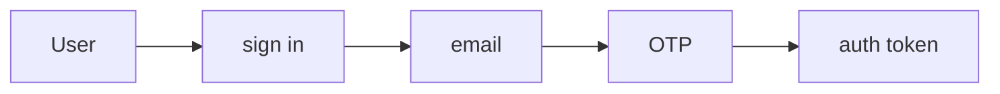
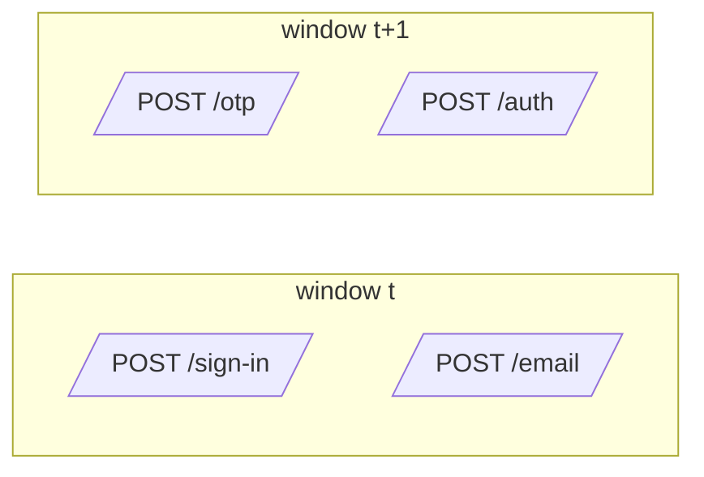
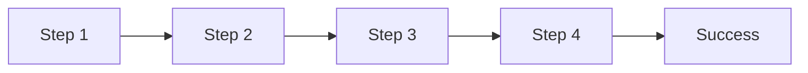

# Journey metrics: flows, users, and requests

When a key action is a multi-step flow, such as a login with an emailed one-time code, every per-call SLI can stay green while the flow breaks. This advanced chapter measures the whole flow, a **journey**, from request counters alone.

Builds on the [KPI tree](kpis.md#the-kpi-tree), [noise and baselines](analysis.md#sampling-noise-vs-real-variation) and [thresholds](alerts.md#threshold-patterns-by-metric-type).

## Rules

1. **Choose 3–5 short journeys, from the key actions that take several steps**, because each needs its own counters, window and alert, and a long journey needs a long, slow window ([Choosing journeys](#choosing-journeys)).
2. **One flow per branch**: tag each major branch (`flow=login_password`, `flow=login_sso`) as its own mostly sequential journey, because mixed branches make the step counts incomparable ([Non-linear flows](#advanced-notes-optional)).
3. **Count requests per step per window, not users**, because aggregate counters are cheap, low-cardinality, and work with any metrics backend ([Why journey metrics](#why-journey-metrics)).
4. **Count each step once per attempt, and only successes at the final step**, because repeats can push success above 100%, and a failed final request would count as a completed journey ([What we count](#what-we-count-requests)).
5. **Make the window 5–10× the average step gap for each step transition $$T_i(t)$$, and the whole journey for the journey success rate $$C(t)$$**, because a smaller window makes the ratios noisy and misleading when traffic changes ([Part 5](#part-5-window-sizing)).
6. **Alert on $$C(t)$$, debug with $$T_i(t)$$**, because any broken step lowers $$C(t)$$, and the $$T_i(t)$$ that dropped points at it ([From flows to metrics](#from-flows-to-metrics)).
7. **Page on $$C(t)$$ with control limits from its observed σ, not burn rates**, because abandonment makes a journey's error budget too large for burn rates, and volume alone understates its variation ([Journey alerts](#journey-alerts), [Part 3](#part-3-real-world-variability-jitter)).
8. **Fixed, not rolling, limits**: set them from a known-good period and update them deliberately, because rolling limits absorb a failure and the alert clears itself ([Journey alerts](#journey-alerts), [Scenario 2](#scenario-2-system-failure-with-seasonal-traffic-t2-drops)).
9. **Set the SLO from the observed baseline, not a round number**, because three steps at 90% already give 73% ([What these metrics tell you](#what-these-metrics-tell-you)).
10. **Use event-based tracking or product-analytics funnels for long async steps, very low traffic, or per-user questions**, because windows would have to be huge and counters have no user IDs ([When this approach fits](#when-this-approach-fits)).

## Why journey metrics



Per-endpoint SLIs can all be green while the journey is broken.



In the [OAuth2 example](#real-world-example-oauth2-device-authorization-grant), when fewer verification page loads end in an authorization (85% → 70%), every endpoint still returns HTTP 200, but journey success drops from 78% to 65%. Broken verification URLs, confusing UX, or timing problems show up only in the flow.

Funnel tools suit product analytics. For SLOs and alerts we found them harder: they need user tracking and custom events, and can get expensive.

This approach uses only aggregate request counts:
- Count requests per step per window (no user IDs)
- Compute ratios between steps
- Monitor them with control charts: one value per window, plotted against control limits set from its normal variation ([kpis.md: Glossary](kpis.md#glossary))

## Choosing journeys

A **journey** is ordered user steps ending in a visible success: sign up, log in, load the app, edit and save, publish, view a page, search, pay. Each step is backed by one or more API calls. Tagged `flow` in metrics.




#### List the journeys behind each key action

Start from each business KPI's key action ([kpis.md](kpis.md#level-1-business-kpis)); when it takes several steps, list the journeys a user must complete to reach it.




#### Rank by traffic and business value

Login and "load the main screen" usually come first, because every other journey depends on them.




#### Start with 3 to 5 and map their calls

Map each step to its calls, marking the critical path ([Map it](kpis.md#map-it)).




#### Keep each journey short

Journey success needs a window several times the journey's duration ([Part 5](#part-5-window-sizing)), so split a long editing session into short journeys (open → editable; save → saved) and alert on those.




## The journey: user and server

Take a multi-step login flow:



The user signs in, receives an email with a one-time password (OTP), enters the OTP, and gets an auth token.

At each step, the user can continue, stop, retry or wait. A long wait and a stop look the same to the metrics until the user comes back ([User behavior](#user-behavior-abandonment-and-retry)).

On the server, each request ends in one of these buckets:

| Bucket | Statuses | What it means |
|---|---|---|
| **Continue** | 2xx | Move the user to the next step. |
| **Retry** | 429, 502, 503, 504 | A transient problem: the client or user can try the same step again. |
| **Fix or stop** | Most other 4xx (400, 401, 403, …) | The request itself was wrong (e.g. a mistyped OTP): the user corrects it and retries, or gives up. |
| **Stop** | Other 5xx | A server-side failure: the journey usually ends, unless the user starts over. |

## What we count: requests

We measure **requests per step** per window, not per-user state.

- per-user: one state machine from "sign in" to "auth token"
- per-request: separate counters, one per endpoint, that know nothing about each other


The journey is connected; the counters are not. A request at `/otp` is never linked to the `/sign-in` request before it. The link comes back only when we compare counts in the same window.

Decide up front which requests count at each step, and keep it consistent:
- **Every request** to the step's endpoint: the step's own errors become part of the next transition ratio.
- **Only successful (2xx) requests**: each ratio is "successful arrivals here per successful arrival at the previous step". The [OAuth2 example](#real-world-example-oauth2-device-authorization-grant) does this.

Either way, the final step counts only successes, or a failed `/auth` request would count as a completed journey.

**Count each step once per attempt.** Autosave sends many `PUT`s per document open; clients poll and retry. Counted per request, these inflate the step's count and can push journey success above 100%. Count a once-per-attempt signal instead: the first successful save per edit session, or a "saved" event. The [OAuth2 example](#real-world-example-oauth2-device-authorization-grant) leaves pending polls out of its token step for the same reason.

## Time and windows

In production there are many requests at once, from many users. To make them measurable and alertable:
- pick a window size (for example 1, 5, or 15 minutes)
- group all requests into these windows
- count how many requests hit each step inside each window

A journey that starts near the end of a window finishes in the next one:



On average the split doesn't bias the ratios: in steady traffic, journeys leaving a window are replaced by journeys arriving from the previous one. But the ratios get **noisier**, and they **mislead when traffic changes**. When sign-ins ramp up, the OTP step still sees the traffic of a few seconds ago, so the ratio reads low; when traffic falls, it reads high, sometimes above 100%. The window should be much bigger than the time between steps ([Part 5](#part-5-window-sizing)).

Volume matters too: the same window bounces at 100 requests and is smooth at 10,000, because sampling noise shrinks as volume grows ([Part 2](#part-2-volume-matters-sampling-noise-vs-signal)). Real variation doesn't ([Part 3](#part-3-real-world-variability-jitter)).

### User behavior: abandonment and retry

Real users don't follow a straight path. Common patterns and their effect:

| Pattern | What the user does | What the metrics see | Effect |
|---|---|---|---|
| **Abandonment** | Gets to step 2, gets distracted, never continues | A request at step 2, never one at step 3 | Lowers the step 2→3 ratio |
| **Long wait** | Comes back after the window closes | An abandonment, then a later request with no matching earlier step | Cancels out in steady traffic |
| **Quick retry**, counting every request | Submits the OTP, gets a 401, retries at once, succeeds | 2 requests at the OTP step, 1 at the next | OTP → auth token ratio is 50% |
| **Slow retry** | Tries step 1 today and gives up; tomorrow succeeds through to the end | Two separate attempts in two unrelated windows | Today's counts as a failure, tomorrow's as a success |

- **Abandonment** lowering the ratio is correct: it should show up as lower journey success.
- **Long waits** are one more reason to size windows to the journey.
- **Quick retries**: if you count only 2xx, the 401 isn't counted and the retry is invisible. Counting every request measures **the share of attempts that move on to the next step**, not "users who eventually succeed". A user who needs three tries counts as 1 in 3.

So the metric is **the fraction of requests in a window that progress to the next step**, retries included. It doesn't track per-user success over unbounded time. That keeps it simple and cheap, and retry storms and other operational issues show up in it. It answers "is the login flow healthy right now?", not "did user X eventually succeed?". For per-user success over days or weeks, use funnel or event analytics.

## From flows to metrics

Notation, for every window $$t$$:

- **Step** $$i$$: a state in the journey ("login form", "OTP page", "/authorize", etc.).
- **Arrival** $$A_i(t)$$: number of requests entering step $$i$$ in window $$t$$.
- **Success step** $$S$$: the last step, with a clear success condition (for example a final HTTP 2xx). Only successful requests count towards $$A_S(t)$$.

For the login flow above, counting every request at each step and only successful requests at the final step:

- $$A_1(t)$$: how many requests hit `/sign-in` in this window
- $$A_2(t)$$: how many requests hit `/email` in this window
- $$A_3(t)$$: how many requests hit `/otp` in this window
- $$A_4(t)$$: how many requests hit `/auth` and succeeded in this window (the success step, so here $$S = 4$$)

From these counts we build:

**Transition ratio** $$T_i(t)$$: what fraction of requests at step $$i$$ made it to step $$i+1$$:

$$T_i(t) = \frac{A_{i+1}(t)}{A_i(t)}.$$

**Journey success rate** $$C(t)$$, or journey success: what fraction of starting requests reached success:

$$C(t) = \frac{A_{S}(t)}{A_1(t)} = \prod_{i=1}^{S-1} T_i(t).$$

[kpis.md](kpis.md#level-1-business-kpis) uses *conversion* for the business KPI (free → paid); this chapter says journey success for $$C(t)$$.

We count requests, not unique users, so retries are part of the signal. The ratios don't depend on volume, but their noise shrinks as traffic grows. Each window counts whatever arrives in it, so a $$T_i(t)$$ can occasionally exceed 1, for example when traffic drops while the next step still receives journeys that started earlier ([Part 5](#part-5-window-sizing)).

The journey KPIs:

| KPI | Measure | Answers |
|---|---|---|
| **Journey success rate** | $$C(t)$$ | "Does the journey work right now?" |
| **Step transition** | $$T_i(t)$$ | "Which step broke?" |
| **Journey volume** | $$A_1(t)$$ | "Can users start?" A drop = users can't reach step 1, or demand fell |
| **Journey latency** | First step to success, p75 and p95, from RUM or traces | "Is it slow enough that people give up?" |
| **Journey SLI** | $$C$$ over 30 days, volume-weighted ([definition](#what-these-metrics-tell-you)) | SLO reporting, error budget |

### What these metrics tell you

**Per-step transition ratio $$T_i(t)$$**:
- "Of the requests that reached step $$i$$, what % made it to step $$i+1$$?"
- In our experience, healthy auth flows often see 85–95% per step (some abandonment and retries); your baseline depends on your flow.
- A drop below your baseline points at step $$i$$, or at something between $$i$$ and $$i+1$$.

**Journey success rate $$C(t)$$**:
- "Of all requests that started the flow, what % completed it?"
- It's the product of all transition ratios, so any failing step lowers it.
- **Errors multiply** ($$C = \prod T_i$$): a critical-path call failing for a fraction $$e$$ of requests turns $$T_i$$ into about $$T_i(1-e)$$ and $$C$$ into about $$C(1-e)$$, both higher if the client retries. Example: $$C = 0.80$$, $$e = 5\%$$ → $$C = 0.76$$, a 4-point drop.

<figure><figcaption><p>Journey success vs the error rate of one critical-path call, with and without a client retry.</p></figcaption></figure>

One client retry (failing only if both tries fail, $$e^2$$) keeps $$C$$ at 0.798, but only if the retry fails independently of the first try. During real incidents failures are correlated, so retries help much less.

**Journey SLI and SLO**: $$C(t)$$ is the measurement per window. Over a period $$P$$, the **journey SLI** is the volume-weighted mean of $$C(t)$$, which is total successes over total starts:

$$\text{SLI}_\text{journey}(P) = \frac{\sum_t A_1(t)\,C(t)}{\sum_t A_1(t)} = \frac{\sum_t A_S(t)}{\sum_t A_1(t)}$$

Under the assumptions above, it approximates the fraction of attempts that eventually succeed. The **SLO** is the target you set on top of it, either:
- volume-weighted: "SLI ≥ 75% over 30 days", or
- window-based: "99% of 5-minute windows have C(t) > 70%".

Set it from the observed baseline: three steps at 90% each already give 73%, so a 70% target would leave almost no headroom.

Dashboards and alerts on these metrics: [Operating journey metrics](#operating-journey-metrics).

## Visualizations

Basic concepts first, then how volume, jitter and failures affect the signal.

Parts 1–4 use a generic flow, not the login flow above: four steps followed by a success step, so $$S = 5$$.



$$C(t) = A_5(t)/A_1(t) = T_1(t)\cdot T_2(t)\cdot T_3(t)\cdot T_4(t)$$, with 90% success on the first three transitions ($$T_1 = T_2 = T_3 = 0.9$$) and $$T_4 = 1.0$$, giving $$0.9^3 \approx 73\%$$ journey success.

[src/flows_plots.py](https://github.com/arnauio/metrics/blob/main/src/flows_plots.py) generates the plots in Parts 1–5 and the OAuth2 scenarios; [src/kpis_plots.py](https://github.com/arnauio/metrics/blob/main/src/kpis_plots.py) generates the errors-multiply plot above ([how to regenerate them](README.md#plots-and-calculator)).

## Part 1: Basic concepts, what are we measuring?

The building blocks: arrivals, transitions and journey success.

### Arrivals per step, healthy flow

<figure><figcaption><p>1,000 requests start at Step 1. With 90% success per step, the counts fall off gradually: Step 1 → 1,000, Step 2 → 900, Step 3 → 810, Step 4 → 729, Step 5 (success) → 729.</p></figcaption></figure>

### Arrivals per step, broken step

<figure><figcaption><p>Arrivals per step when T2 drops to 0.2.</p></figcaption></figure>

Same starting volume, but $$T_2$$ (Step 2 → Step 3) drops to 20%. Step 3 onward sees far fewer requests: the cliff sits between Step 2 and Step 3 and carries through the rest of the flow.

### Side-by-side comparison

<figure><figcaption><p>Arrivals per step, healthy vs broken.</p></figcaption></figure>

Side by side, the broken step is obvious. When $$C(t)$$ drops, this is the question to ask: which $$A_i(t)$$ changed most?

### Transition ratios

<figure><figcaption><p>Transition ratios, healthy vs broken.</p></figcaption></figure>

Per step: every transition looks healthy except $$T_2$$, where the flow broke.

### Journey success rate

<figure><figcaption><p>The number you'd alert on, and the basis of the journey SLI: 73% healthy → 16% broken.</p></figcaption></figure>

## Part 2: Volume matters, sampling noise vs signal

An **individuals chart** plots one value per window, here $$C(t)$$, against fixed limits from a healthy baseline. All control limits in Parts 2–4 are individuals-chart limits: mean ± 3σ, with σ estimated from the average moving range of the baseline windows.

### Low volume: 100 requests per window

<figure><figcaption><p>100 requests per window: wide limits.</p></figcaption></figure>

At 100 requests per window, $$C(t)$$ bounces visibly (sampling noise, σ ≈ 0.04). The limits must be wide: about ±0.13.

### Medium volume: 10k requests per window

<figure><figcaption><p>10k requests: much smoother, tighter limits (about ±0.01). Good operating range for most production flows.</p></figcaption></figure>

### High volume: 1M requests per window

<figure><figcaption><p>1M requests: nearly flat (limits about ±0.001). Even tiny degradations are obvious.</p></figcaption></figure>

Sampling noise shrinks with $$1/\sqrt{n}$$: 100× the traffic gives 10× tighter limits. This assumes each request succeeds or fails independently; Part 3 shows what happens when it doesn't.

## Part 3: Real-world variability (jitter)

Production systems have real variation: performance fluctuations, time-of-day effects, load changes. We model this as **jitter**: in each window, each $$T_i$$ is drawn uniformly from $$T_i ± 0.05$$ (5 percentage points). $$T_4 = 1.0$$ can't go higher, so it stays fixed.

Does more volume remove it?

### Low volume with jitter

<figure><figcaption><p>100 requests per window with jitter: more variation, wider limits.</p></figcaption></figure>

With 100 requests per window and jitter on each step, $$C(t)$$ varies more: σ goes from 0.04 (Part 2.1) to about 0.07. The mean stays around 73%, but single windows range widely, and the limits must be wide to cover this real variation.

### High volume with jitter, same problem persists

<figure><figcaption><p>Same flow and jitter, at 1M requests per window. The mean is still ~73%, but <strong>the control limits barely tighten</strong>.</p></figcaption></figure>

Without jitter, going from 100 to 1M requests shrank the limits from ±0.13 to about ±0.001; with jitter, only from about ±0.20 to ±0.12. The variation is real: each window has a different success rate.

Volume reduces sampling noise, not real variation: a system that fluctuates by a few points per window does so at any scale. How to measure σ from healthy data: [analysis.md](analysis.md#sampling-noise-vs-real-variation).

### What can you do about jitter?

- **Bigger windows**: 15-30 min instead of 5 min (slower detection)
- **Moving averages**: smooth the signal (adds lag)
- **Wider thresholds**: require sustained degradation to alert
- **Fix the source**: improve system stability (best long-term)

### Moving average control limits

<figure><figcaption><p>5-window moving average (blue) vs raw values (gray), at 1M requests with jitter.</p></figcaption></figure>

Same scenario as 3.2, alerting on a 5-window moving average (blue) instead of the raw values (gray). The average of $$w$$ windows has $$\sqrt{w}$$ times less variation, so its limits are $$\sqrt{5} \approx 2.2\times$$ tighter: about ±0.055 instead of ±0.12. A smaller sustained drop is now enough to cross them.

Compute σ from the **raw** values and divide by $$\sqrt{w}$$. Don't compute it from the moving ranges of the average itself: neighbouring averages share 4 of their 5 inputs, so they barely move from one window to the next, and the limits come out far too tight and fire on healthy traffic.

The cost is lag. A 5-window average reacts to a sudden drop with about 2 windows of delay on average, and shows the full drop only after 5 windows (50 minutes with 10-minute windows).

## Part 4: Detecting real failures

After 40 healthy windows, we inject a failure from window 41: $$T_2$$ drops from 0.9 to 0.8.

### Low volume: 100 requests

<figure><figcaption><p>Detectable but noisy: wait for several bad windows before alerting.</p></figcaption></figure>

### High volume: 1M requests

<figure><figcaption><p>Immediately obvious. Every post-failure window would trigger.</p></figcaption></figure>

Failures are detectable at any volume, but high volume makes detection cleaner.

## Part 5: Window sizing



The most common mistake is a window too small for the flow.



[5.3](#how-to-choose-window-size) gives the rule for the window $$W$$. For your own gaps: `uv run src/calc.py spillover --gap <avg gap> --window <W>`.

### Why window size matters

Each window counts whatever arrives in it. A request that enters step $$i$$ just before a window boundary reaches step $$i+1$$ in the next window. On average, the share of $$A_{i+1}(t)$$ that started in an earlier window is about

$$\text{spillover} \approx \frac{\text{average gap between step } i \text{ and step } i+1}{W}$$

where $$W$$ is the window length. With a 1-minute average gap, that's about 20% for a 5-minute window, and about 7% for 15 minutes.

With steady traffic, spillover into a window is balanced by spillover out of it, so $$T_i(t)$$ is still correct on average. It's just noisier, because $$A_i(t)$$ and $$A_{i+1}(t)$$ share fewer requests.

<figure><figcaption><p>Measured T1(t) in 1-minute windows at three volumes: timing noise.</p></figcaption></figure>

A single transition $$T_1(t)$$, measured in 1-minute windows with a 1-minute average gap between the steps. Three volumes (20, 200, 2000 requests/min) share the same true success rate (90%, dashed line). At low volume the measured ratio swings from about 0.5 to 1.5.

Part of that is ordinary sampling noise. Most of it is **timing noise**: with the window as short as the gap, most step-2 requests in a window started step 1 in an earlier window. $$A_1(t)$$ and $$A_2(t)$$ are counting mostly different requests, so their random fluctuations don't cancel out. More volume or bigger windows both fix this.

With changing traffic, step $$i+1$$ sees the traffic of one gap ago. When traffic rises, $$T_i(t)$$ reads low; when it falls, $$T_i(t)$$ reads high, even above 1. The bigger the spillover, the bigger the error.

It's Little's Law: at any moment, about (arrival rate × average gap) journeys are between two steps. The window has to be long enough that this in-flight group is a small part of what it counts.

### What a too-small window looks like

<figure><figcaption><p>A traffic spike distorts T1(t) in small windows, though nothing is broken.</p></figcaption></figure>

Nothing is broken here: true $$T_1$$ is 0.9 throughout. For 15 minutes, step-1 traffic jumps from 200 to 1,000 requests/min (a marketing push, a batch of devices, a bot wave). The average gap between the steps is 1 minute.
- 1-minute windows: $$T_1$$ dips to about 0.45 as the spike starts (step 1 sees the new traffic first), then jumps to about 3 as it ends (step 2 is still draining the spike while step 1 is back to normal). That looks like a failure and then a recovery above 100%.
- 5-minute windows: the same shape, but smaller: about 0.75, then 1.6.
- 15-minute windows: much smaller: about 0.85, then 1.15.

Signs that your window is too small:
- $$T_i(t)$$ regularly above 1
- Dips in $$T_i(t)$$ that line up with rises in $$A_1(t)$$, and bumps that line up with falls
- A noisy $$T_i(t)$$ even at high volume, while the same ratio over a larger window is smooth

If per-step counts differ by orders of magnitude (say 1,000 at step 1 and 500,000 at step 2), that is not a window problem. More likely you're counting something else: polling requests, a missing status filter, or an endpoint shared with another flow.

### How to choose window size




#### Measure flow timing

From events (spans or logs), get the average time between each pair of steps and for the whole journey.




#### Size the window from the gaps

As a rule of thumb, make the window **5–10× the average gap between consecutive steps**, which keeps spillover around 10–20%.
- For each $$T_i(t)$$, use the gap between step $$i$$ and step $$i+1$$.
- For $$C(t)$$, use the average time of the **whole journey**, from step 1 to success, because $$C(t)$$ compares the first and last steps directly.

If the gaps have a long tail, the average overstates spillover: a user slower than the window can only spill into the next window once. Size the window from the bulk of journeys (for example the median plus a margin) rather than from the tail.




#### Check traffic volume

Aim for at least 100 journeys starting per window; 1,000+ is better. If volume is too low, use larger windows (15–30 min) or accept that you're monitoring trends, not real time. Larger windows mean less noise but slower detection.




**Example: OAuth2 device flow** (the [real-world example](#real-world-example-oauth2-device-authorization-grant) below)

| Transition | What happens | Average gap |
|---|---|---|
| **Step 1→2** | User opens a browser after seeing the device code | ~1 minute, p95 ~3 minutes |
| **Step 2→3** | User types the code and authorizes | ~30 seconds |
| **Step 3→4** | Device polls and gets the token | A few seconds, one polling interval |
| **Step 4→5** | Device uses the token for an API call | Seconds |

The whole journey averages about 1.5–2 minutes. Using the rule:
- 1-minute window: too small. With the window as short as the gap, the formula above breaks down; for this gap distribution, about 60% of step-2 requests started in an earlier window.
- 5-minute window: fine for $$T_2$$–$$T_4$$, which have short gaps. Borderline for $$T_1$$ (about 20% spillover) and $$C(t)$$ (30–40%), which shows up as noise and as errors during traffic ramps.
- 10–15-minute window: good for $$T_1$$ and $$C(t)$$. This is what the example below uses.

You can also use different windows per ratio: short windows for fast inner steps, longer for $$T_1$$ and $$C(t)$$.

### How to validate

Plot $$T_i(t)$$ at two window sizes (say 5 and 15 minutes) over a day with a traffic ramp. If the smaller window shows dips during ramp-ups, bumps during ramp-downs, or values above 1 that the larger one doesn't, the smaller window is too small.

For flows with long or variable gaps (email verification over hours, human review, async jobs), a window long enough to contain the journey makes a slow, laggy signal ([other approaches](#when-this-approach-fits)).

## Real-world example: OAuth2 Device Authorization Grant

A real authentication flow: the OAuth2 Device Authorization Grant ([RFC 8628](https://datatracker.ietf.org/doc/html/rfc8628), the "device flow"), used by smart TVs, CLI tools, and IoT devices.

### The flow

| Step | What happens | How it shows |
|---|---|---|
| **1** | Device requests a device code | `POST /device_authorization` returns `device_code` and `user_code` |
| **2** | User visits the verification URL | User opens a browser and navigates to the `verification_uri` |
| **3** | User enters the code and authorizes | User types the `user_code`, reviews permissions, grants access |
| **4** | Device polling succeeds | Device polls `POST /token` and receives valid tokens |
| **5** (success, $$S = 5$$) | Device has a working access token | First API call with the token succeeds |

### Metrics for a 10-minute window

Per window $$t$$, count requests at each step (10 minutes follows [the rule above](#how-to-choose-window-size)):
- $$A_1(t)$$: number of `POST /device_authorization` requests
- $$A_2(t)$$: number of verification page GET requests (HTTP 200)
- $$A_3(t)$$: number of successful authorization POST requests (consent granted)
- $$A_4(t)$$: number of `POST /token` requests that return valid tokens (HTTP 200 with token). Pending polls (`authorization_pending`) are not counted, or they would swamp this step.
- $$A_5(t)$$: number of requests to protected resources that succeed with these tokens

Transitions:
- $$T_1(t) = A_2(t)/A_1(t)$$: verification page loads per device auth request
- $$T_2(t) = A_3(t)/A_2(t)$$: successful authorizations per verification page load
- $$T_3(t) = A_4(t)/A_3(t)$$: token retrievals per authorization grant
- $$T_4(t) = A_5(t)/A_4(t)$$: successful API calls per token retrieval

Journey success rate:

$$C(t) = \frac{A_5(t)}{A_1(t)} = T_1(t) \cdot T_2(t) \cdot T_3(t) \cdot T_4(t)$$

A user who restarts the flow generates another device auth request, so retries show up in $$A_1(t)$$ and lower $$C(t)$$.

### Typical healthy values

| Ratio | Typical | Why |
|---|---|---|
| $$T_1$$ | ≈ 0.95 | Most device auth requests lead to verification page loads |
| $$T_2$$ | ≈ 0.85 | Some verification page loads don't result in authorization completion |
| $$T_3$$ | ≈ 0.98 | Authorization grants reliably lead to token retrieval |
| $$T_4$$ | ≈ 0.99 | Tokens usually work for API calls |
| $$C$$ (overall) | ≈ 0.78 | ~78% of device auth requests result in successful API calls |

### What this catches

If $$T_2$$ drops from 0.85 to 0.70, every endpoint still returns HTTP 200, but $$C$$ drops from $$0.95 \times 0.85 \times 0.98 \times 0.99 = 0.78$$ to $$0.95 \times 0.70 \times 0.98 \times 0.99 = 0.65$$ (65%). This is the case from [Why journey metrics](#why-journey-metrics).

## Scenarios

Each scenario shows how one kind of change affects the OAuth2 metrics. Each window has 10k device auth requests unless the traffic follows a daily cycle, and each $$T_i$$ jitters by ±0.02 (narrowed near 1, so $$T_4 = 0.99$$ only jitters by ±0.01). Degradations start at window 21, after 20 healthy windows.
- Scenarios 1, 4 and 5 alert on a 5-window moving average, with limits computed as in [Moving average control limits](#moving-average-control-limits).
- Scenarios 2 and 3 have a daily traffic cycle and use **volume-aware limits**: a **p-chart** (a control chart for a proportion, whose limits depend on each window's volume), plus the real variation measured in the healthy baseline.

### Scenario 0: Volume independence

<figure><figcaption><p>OAuth2: journey success stays flat while traffic varies 20×.</p></figcaption></figure>

Traffic varies 20× (500→10k→500 req/window), yet $$C(t)$$ stays ~78%. Volume affects noise, not signal, which is why ratios work at any scale.

### Scenario 1: User behavior change, T1 drops

<figure><figcaption><p>OAuth2: user behavior change.</p></figcaption></figure>

$$T_1$$ drops from 0.95 to 0.80 at window 21. Likely a UX issue (broken link, confusing instructions). The moving average crosses the lower limit in the first bad window and settles around 66%.

### Scenario 2: System failure with seasonal traffic, T2 drops

<figure><figcaption><p>OAuth2: system failure with seasonal traffic.</p></figcaption></figure>

Daily traffic pattern with $$T_2$$ degrading at window 21. The limits are fixed from the healthy baseline ([why](#journey-alerts)), so every bad window stays below them.

### Scenario 3: Seasonal pattern, healthy flow

<figure><figcaption><p>Daily cycle, healthy throughout. The limits widen at night (about ±0.08 at 500 requests/window) and tighten at peak (about ±0.06 at 10k).</p></figcaption></figure>

At peak (10k requests), sampling noise (σ ≈ 0.004) is small next to the real variation from the ±0.02 jitter per step (σ ≈ 0.02), so the jitter sets the width. At night (500 requests) the two are about equal, so the limits widen by only about a third. As in Part 3, past some volume more traffic stops tightening the limits.

### Scenario 4: Polling failure, T3 drops

<figure><figcaption><p>OAuth2: polling failure.</p></figcaption></figure>

$$T_3$$ drops from 0.98 to 0.85. Polling timeouts or rate limiting.

### Scenario 5: Token validation, T4 drops

<figure><figcaption><p>OAuth2: token validation failure.</p></figcaption></figure>

$$T_4$$ drops from 0.99 to 0.90. Tokens are issued but fail on API calls.

## Operating journey metrics

Dashboards, alerts and impact sizing for journeys, on top of the per-call ones in [dashboards.md](dashboards.md#the-dashboard-set) and [alerts.md](alerts.md#what-to-page-on).

### Journey dashboard

Add the counters to your [stack map](dashboards.md#map-to-your-stack):
- **Journey counters**: a metrics backend or event pipeline, such as Prometheus, Cloud Monitoring, or wide events ([events.md](events.md)).

In the [KPI overview](dashboards.md#dashboard-1-kpi-overview):

| Panel | What it shows | Chart |
|---|---|---|
| **Journey success rate** | $$C(t)$$ per journey, last 24 h, against its control limits | Small multiples, one per journey |
| **SLO status** | Journey SLI over 30 days vs target; error budget remaining | Stat tiles, green/yellow/red |

One dashboard per journey, between the KPI overview and the API calls. Drill-down: KPI tile → its journey → a step's calls → their dependencies.

| Panel | What it shows | Chart |
|---|---|---|
| **Funnel now vs last week** | $$A_i$$ per step, current window and the same window a week ago | Grouped bars |
| **Journey success rate** | $$C(t)$$ with control limits | Time series |
| **Step transitions** | $$T_i(t)$$ per step, with limits | Small multiples |
| **Volume** | $$A_1(t)$$ with last week's line | Time series |
| **Journey latency** | p75, p95 from first step to success | Time series |
| **Failing calls per step** | Top calls by error count on each step's critical path | Table |
| **Segments** | $$C$$ by platform, client version, region, plan tier | Table or heatmap |

Window size for the ratios follows the journey's timing ([Part 5](#part-5-window-sizing)).

### Journey alerts

- **Page on $$C(t)$$** of each key journey: it's a symptom users feel ([alerts.md](alerts.md#what-to-page-on)). Debug with $$T_i(t)$$: the one that dropped points at the broken step.
- **Control limits from the observed σ** of healthy windows: alert below μ − 3σ, sustained over a few windows. Binomial σ (from volume alone) fires constantly ([why](analysis.md#sampling-noise-vs-real-variation)).
- **Fixed, not rolling, limits**: compute them from a known-good period and update them deliberately as the system evolves. Limits recomputed from a rolling window slowly absorb a failure, and the alert clears itself ([Scenario 2](#scenario-2-system-failure-with-seasonal-traffic-t2-drops), [analysis.md](analysis.md#baselines-and-seasonality)).
- **Window** sized to the whole journey ([Part 5](#part-5-window-sizing)).
- **Not with burn rates.** [Burn-rate tiers](alerts.md#slo-burn-rate-alerts) assume a small error budget (targets of 99% and up). A journey's normal failures include abandonment (e.g. $$C \approx 0.92$$), so its budget is large and a 14.4× burn is impossible. Journeys still have an SLO (target from the baseline, failure fraction $$1 - C$$): track the [journey SLI](#what-these-metrics-tell-you) against it over a month for reporting, and alert with control limits.
- **Journey volume** $$A_1(t)$$ is traffic: alert on drops from a [time-of-week baseline](alerts.md#traffic-volume).
- **No baseline yet**: start with journey $$C$$ below 80% of its first week's average, and tune after 1–2 weeks ([alerts.md](alerts.md#if-you-have-no-baseline-yet)).

Example alert rule (pseudo-config):

```text
alert: AuthJourneyDegraded
when:  auth_journey_success < 0.875 for 15m
# 0.875 = μ − 3σ, with μ 0.92 and σ 0.015 measured on healthy windows
# of a known-good period; fixed, not recomputed on a rolling window
```

Control charts for $$C(t)$$ and $$T_i(t)$$:
- **Individuals chart**: simple, works when volume per window is roughly stable.
- **p-chart**: limits widen at low volume and tighten at high volume. On its own it assumes sampling noise is the only noise, so at high volume it fires on normal jitter. Add the real variation from a healthy baseline (Scenario 3, or a Laney p′ chart, a p-chart whose limits are widened by the window-to-window variation measured in the baseline).
- **Instead of control charts**, you can use simple alert rules (for example static thresholds on $$C(t)$$) or your metrics backend's anomaly detection or forecasting, with the same $$T_i(t)$$ and $$C(t)$$ as inputs.

### Sizing a regression

Did an API regression move a journey? Apply the [attribution recipe](analysis.md#did-it-move-the-kpi-an-attribution-recipe) at the journey level:
- **Place it**: the call is on the critical path of a step → check that step's $$T_i$$, then the journey's $$C$$, then the business KPI.
- **Test it against real variation**: is the change in $$T_i$$ bigger than its usual week-over-week change in healthy weeks, or than a control segment's? A z-test alone covers sampling noise only. For latency, compare the p95 with a bootstrap interval ([analysis.md](analysis.md#formulas)).
- **Confounders** include a traffic-mix shift: a bot wave lowers ratios without any bug ([Traffic mix](#advanced-notes-optional)).
- **Size it**: extra failed or abandoned journeys ≈ $$A_1$$ per hour × drop in $$C$$ × duration, with its interval. Business impact = failed journeys × share that never comes back and succeeds.

## Advanced notes (optional)

Notes for rolling this out in production.

**Non-linear flows**
- In practice each major branch is its own mostly sequential flow, tagged `flow=<journey>_<method>` (for example `flow=login_password`, `flow=login_sso`, `flow=login_webauthn`).
- Retries are extra noise in $$A_i(t)$$ and $$T_i(t)$$ ([User behavior](#user-behavior-abandonment-and-retry)). Split out first attempts vs retries only if you need to distinguish "hard failures" from "eventual success after many retries".

**SLIs, SLOs, and cost**
- Typical stack: per-endpoint availability + latency **and** the journey success rate $$C(t)$$ on top, with the [journey SLI](#what-these-metrics-tell-you) over a period.
- Per-step SLOs locate the broken component; journey SLOs say whether the journey works.
- A small, controlled `flow` tag adds predictable metric cardinality and is usually cheap in managed backends ([dashboards.md](dashboards.md#tagging-and-cardinality)).

**Traffic mix, bots, and abuse**
- Arrivals mix real users, automated clients and abusive sources. All of them count in $$A_i(t)$$, $$T_i(t)$$ and $$C(t)$$.
- If the mix is **stable**, its effect is baked into your baseline and limits.
- When abuse/bot traffic surges, you often see $$A_1(t)$$ spike and transitions drop.

## When this approach fits

This builds on Google SRE's journey-based SLIs ([SRE Workbook](https://sre.google/workbook/implementing-slos/#modeling-user-journeys)) and on Statistical Process Control (SPC) from manufacturing. Nothing new: it ties journey SLIs, SPC and standard metrics backends together, with concrete math.

**Good fit**:
- **Steps are mostly sequential**: login → MFA → token → success.
- **Step timing is bounded**: journeys take seconds to minutes, not hours, so a window sized to the whole journey stays short ([Part 5](#part-5-window-sizing)).
- **Volume is moderate to high**: at least 100 requests per window, ideally 1,000+.
- **You want operational SLIs**: "Is the login flow healthy right now?"
- **Cost matters**: aggregate counters are cheaper than per-user events.

**Other approaches are better**:
- **Long async steps**, such as email verification that takes hours or days. Windows would need to be very large (1 day+), making detection slow. Use event-based tracking or product-analytics funnels.
- **Very low traffic**, under ~100 requests per window. Sampling noise makes the ratios jump around. Use longer windows, or synthetic monitoring plus event tracking.
- **Complex branching**, with lots of optional paths and loops. It can still work, but you need a separate flow for each major branch ([Non-linear flows](#advanced-notes-optional)).
- **Per-user analysis**, such as "show me all users who failed step 2". This approach has no user IDs. Use wide events and their spans ([events.md](events.md)), or product analytics.
- **Attribution across long time spans**, such as "of users who signed up last month, how many completed setup?". That's a funnel or cohort question, not an operational health question. Use product analytics tools.

Journey Metrics is the cheap operational signal: SLIs, alerts, dashboards. In our experience, it works best next to wide events (spans) for debugging specific failures, product analytics for longer-term funnels and A/B tests, and synthetic checks for baseline health:

| Approach | How it works | What it is best at | Main tradeoffs |
|---|---|---|---|
| **Real User Monitoring / Funnels** | Client events per user/session, queried as funnels | Product analytics, paths, cohorts, UX questions | Needs identity, higher cost, awkward for SLOs |
| **Synthetic monitoring** | Bots run scripted journeys | Smoke tests, external checks, third parties | Fake traffic, limited scenarios, no load info |
| **Wide events and traces** ([events.md](events.md)) | One rich event per request; spans add trace context across services | Ad-hoc "show me all requests where…" queries, debugging specific failures | Cost grows with volume and width; sampled |
| **This Journey Metrics model** | Aggregate request counters per step and time window | Cheap, simple journey SLIs and SLOs | Less flexible for arbitrary ad-hoc questions |

**Beyond login flows**, the same counters work for any short, mostly sequential pipeline:
- **API rate limiting and retry policies**: track end-to-end success including retries; detect when rate limits are too aggressive or retries mask degradation.
- **Payment processing flows**: measure checkout-to-settlement success; catch revenue leaks where per-endpoint metrics show success but customers don't complete payment.
- **CI/CD pipelines**: reveal the real deployment success rate. Five stages at 98% each give only 90% end-to-end.
- **Data ingestion pipelines**: detect when data arrives but doesn't fully propagate through validation, transformation, and caching.
- **Service mesh / distributed systems**: catch cross-service success drops that per-service SLIs miss due to cascading timeouts or retries.
- **Email delivery pipelines**: measure accepted → delivered, beyond "accepted by SMTP"; detect ISP blocking and spam filtering. This works when the stages complete within minutes, not when you're waiting on a human to open the email.
