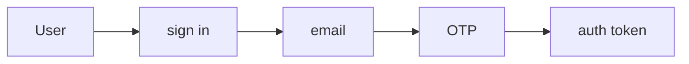
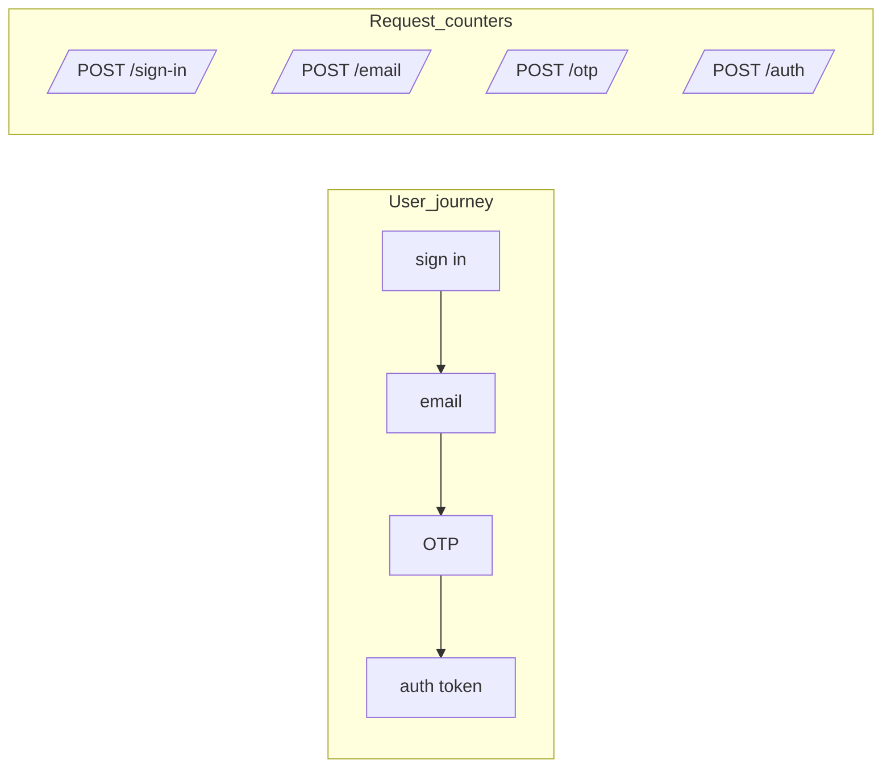
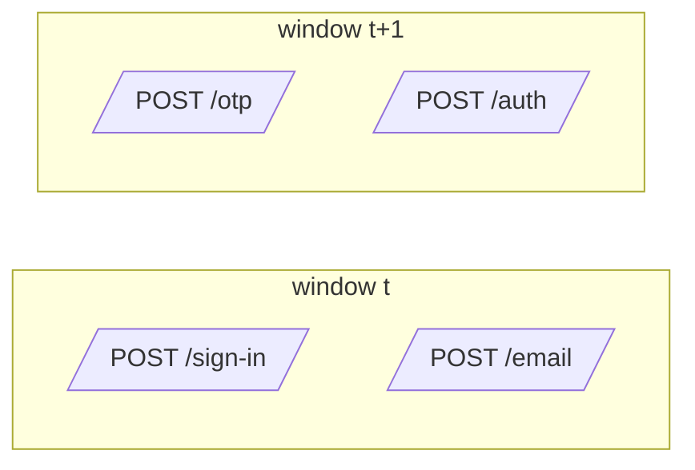

# Auth flows, users, and requests

This document is a **story-first intro** to Journey Metrics.
It uses a concrete auth example to show:
- what the user is doing
- what the server is doing
- what **requests** we actually count
- how time windows turn this into metrics

After this, [README.md](README.md) picks up with the full math
and control-chart visualizations.

## 1. The journey: user and server

Consider a multi-step authentication flow:



The user signs in, receives an email with a one-time password (OTP), enters the OTP, and gets an auth token.

At each step, the user can:
- continue
- stop
- retry
- wait

A long wait and a stop look the same to the metrics until the user comes back. Section [3.4](#34-user-behavior-abandonment-and-retry) covers what that means.

From the server's perspective, each request ends in one of a few buckets:
- **continue (2xx)**: move the user to the next step.
- **retry (429, 502, 503, 504)**: a transient problem. The client or user can try the same step again.
- **fix or stop (most other 4xx: 400, 401, 403, …)**: the request itself was wrong, for example a mistyped OTP. The user either corrects it and retries, or gives up.
- **stop (other 5xx)**: a server-side failure. The journey usually ends here, unless the user starts over.

## 2. What we count: requests

What we actually measure in Journey Metrics is **requests per step** per window, not per-user state.

- per-user: one state machine from "sign in" to "auth token"
- per-request: separate counters, one per endpoint, that know nothing about each other



The user journey is connected; the counters are not. We never link a request at `/otp` to the request at `/sign-in` that came before it. The connection only comes back when we compare counts in the same time window.

Decide two things up front, and keep them consistent:
- **Which requests count at each step.** Either every request to the step's endpoint, or only the successful (2xx) ones. Counting every request makes a step's own errors part of the next transition ratio. Counting only 2xx makes each ratio "successful arrivals here per successful arrival at the previous step". [README.md](README.md) counts successful requests.
- **The final step counts only successes.** Otherwise a failed `/auth` request would count as a completed journey.

## 3. Time and windows

So far we looked at **one** user or **one** request.
In production we have **many** requests, all the time, from many users.

To make this measurable and alertable we:
- pick a window size (for example 1, 5, or 15 minutes)
- group all requests into these windows
- count how many requests hit each step inside each window

As a guideline, the window should be **much bigger than the time between steps**. [README Part 5](README.md#part-5-window-sizing) explains why and shows what goes wrong otherwise.

### 3.1 Concrete example: window size

Suppose your auth flow has these typical timings:
- sign in → email: 2 seconds (server processing)
- email → OTP entry: 15 seconds (user checks email, copies code)
- OTP → auth token: 1 second (server validation)

Average journey time: ~18 seconds; p95 might be ~30 seconds.

A journey that starts near the end of a window finishes in the next one:



The share of journeys split like this is roughly **average journey time ÷ window**:
- **15-second windows**: more than one boundary per journey, on average. Most journeys are split.
- **1-minute windows**: about 30% of journeys are split.
- **5-minute windows**: about 6% are split.

Splitting doesn't make the ratios wrong on average. In steady traffic, journeys leaving a window are replaced by journeys arriving from the previous one. But the ratios get **noisier**, and they get **misleading when traffic changes**: when sign-ins ramp up, the OTP step still sees the traffic of a few seconds ago, so the ratio reads low. When traffic falls, it reads high, sometimes above 100%. The more journeys are split, the bigger the effect.

For this flow, a 5-minute window works well. The rule of thumb is window ≥ **5–10× the average time between steps** for a transition ratio, and 5–10× the average **whole-journey** time for end-to-end conversion.

### 3.2 Concrete example: volume matters

The same 5-minute window behaves differently at different traffic levels. Assume a true success rate of 90%, and count the successes in each window:

**Low traffic (100 sign-ins per 5 minutes)**:
- You'd expect ~90 successes.
- Sampling noise alone puts 95% of windows between about 84 and 96.
- That's ±6 percentage points just from randomness.
- Hard to distinguish a real 5-point drop from noise.

**High traffic (10,000 sign-ins per 5 minutes)**:
- You'd expect ~9,000 successes.
- 95% of windows fall between about 8,940 and 9,060.
- That's ±0.6 percentage points.
- A real 5-point drop (down to 8,500) is unmistakable.

This is why the approach works better at higher volume: sampling noise shrinks as volume grows. These ranges assume each request succeeds or fails independently. Real systems also have variation that more volume doesn't remove ([README Part 3](README.md#part-3-real-world-variabilityjitter)).

### 3.3 Window selection strategy

For production systems:

1. **Measure your flow timing first**: use traces or logs to get the average time between each pair of steps, and the average whole-journey time.
2. **Pick the window**: 5–10× the average journey time for `C(t)`. Inner steps with short gaps can use shorter windows.
3. **Check traffic volume**: aim for at least 100 sign-ins per window; 1,000+ is better.
4. **If volume is too low**: use larger windows (15–30 min) or accept that you're monitoring trends, not real time.
5. **Trade-off**: larger windows mean less noise but slower detection.

### 3.4 User behavior: abandonment and retry

Real users don't follow perfect linear paths. Here's how common patterns affect the metrics:

**Abandonment (user stops mid-flow)**:
- User gets to step 2, gets distracted, never continues.
- Metrics: request counted at step 2, but never at step 3.
- Effect: lowers the step 2→3 transition ratio.
- This is **correct behavior**: abandonment should show up as lower conversion.

**Long wait (user comes back after the window closes)**:
- In the window where they stopped, the user looks like an abandonment.
- When they come back, their next request lands in a later window without a matching earlier step.
- In steady traffic these cancel out. It's one more reason to size windows to the journey.

**Quick retry (user mistyped the OTP)**, counting every request:
- User submits the OTP, gets a 401, immediately retries, succeeds.
- Metrics: 2 requests at the OTP step, 1 request at the next step. (If you count only 2xx, the 401 isn't counted and the retry is invisible.)
- Effect: the OTP → auth token ratio is 50%.
- This measures **the share of attempts that move on to the next step**, not "users who eventually succeed". A user who needs three tries counts as 1 in 3.

**Slow retry (user comes back tomorrow)**:
- User tries step 1 today, gives up.
- User tries step 1 again tomorrow, succeeds through to the end.
- Metrics: two separate attempts in two unrelated windows. Today's counts as a failure, tomorrow's as a success.

**What this approach measures**: **"what fraction of requests successfully progress to the next step"** in a given window, including retries. It doesn't track per-user success over unbounded time. That keeps the implementation simple and cheap, and retry storms and other operational issues show up in it naturally. The question it answers is "is the login flow healthy right now?", not "did user X eventually succeed?".

For per-user success tracking over days or weeks, funnel or event analytics tools are a better fit.

## 4. From flows to metrics

Once we have windows, for every window `t` we can say things like the following (counting every request at each step, and only successful requests at the final step):

- `A_1(t)`: how many requests hit `/sign-in` in this window
- `A_2(t)`: how many requests hit `/email` in this window
- `A_3(t)`: how many requests hit `/otp` in this window
- `A_4(t)`: how many requests hit `/auth` and succeeded in this window (the final step, `A_S`)

From these **counts per step, per window** we can build:

- **Transition ratios**: `T_i(t) = A_{i+1}(t) / A_i(t)` — what fraction of requests at step `i` made it to step `i+1`
- **End-to-end conversion**: `C(t) = A_S(t) / A_1(t)` — what fraction of starting requests reached success

Because each window counts whatever arrives in it, a `T_i(t)` can occasionally exceed 1, for example when traffic drops and the next step is still receiving journeys that started earlier.

### 4.1 What these metrics tell you

**Per-step transition ratio `T_i(t)`**:
- "Of the requests that reached step `i`, what % made it to step `i+1`?"
- In our experience, healthy auth flows often see 85–95% per step (some abandonment and retries), but your baseline will depend on your specific flow.
- A drop below your baseline points at step `i`, or at something between `i` and `i+1`.

**End-to-end conversion `C(t)`**:
- "Of all requests that started the flow, what % completed it?"
- This is the product of all transition ratios: `C(t) = T_1(t) × T_2(t) × T_3(t) × ...`
- If any step fails, `C(t)` drops.

**SLI and SLO**: `C(t)` is the measurement. Over a longer period, the **flow SLI** is total successes over total starts, `ΣA_S / ΣA_1` ([README](README.md#advanced-notes-optional)). The **SLO** is the target you set on top of it, either:
- volume-weighted: "SLI ≥ 75% over 30 days", or
- window-based: "99% of 5-minute windows have C(t) > 70%".

Set the target from your observed baseline, not from a round number. Three steps at 90% each already give 73%, so a 70% target would leave almost no headroom.

### 4.2 Operational use

Once you have `C(t)` calculated for each window:

1. **Dashboard**: plot `C(t)` over time with control limits ([README Part 2](README.md#part-2-volume-matterssampling-noise-vs-signal)).
2. **Alert**: fire if `C(t)` drops below a threshold for N consecutive windows.
3. **Debug**: check which `T_i(t)` dropped to find the broken step.
4. **SLO**: track the SLI against its target over a month.

Example alert rule (pseudo-config):

```text
alert: AuthFlowDegraded
when:  auth_flow_conversion < 0.70 for 2 consecutive 5-minute windows
# healthy baseline for this flow ≈ 0.85
```

A fixed threshold is the simplest start. Control limits from a healthy baseline adapt the threshold to your actual noise; [alerts.md](alerts.md#threshold-patterns-by-metric-type) shows how to set them for journey conversion.

## 5. When this approach fits

### 5.1 Good fit

- **Steps are mostly sequential**: login → MFA → token → success.
- **Step timing is bounded**: journeys take seconds to minutes, not hours.
- **Volume is moderate to high**: at least 100 requests per window, ideally 1,000+.
- **You want operational SLIs**: "Is the login flow healthy right now?"
- **Cost matters**: aggregate counters are cheaper than per-user events.

### 5.2 Other approaches are better

- **Long async steps**, such as email verification that takes hours or days. Windows would need to be very large (1 day+), making detection slow. Use event-based tracking ([events.md](events.md)).
- **Very low traffic**, under ~100 requests per window. Sampling noise makes the ratios jump around. Use longer windows, or synthetic monitoring plus event tracking.
- **Complex branching**, with lots of optional paths and loops. It can still work, but you need a separate flow for each major branch, for example `flow=login_password`, `flow=login_sso`, `flow=login_webauthn`.
- **Per-user analysis**, such as "show me all users who failed step 2". This approach has no user IDs. Use tracing or event analytics ([events.md](events.md)).
- **Attribution across long time spans**, such as "of users who signed up last month, how many completed setup?". That's a funnel or cohort question, not an operational health question. Use product analytics tools.

### 5.3 Combining tools

Journey Metrics is the cheap operational signal: SLIs, alerts, dashboards. In our experience, it works best next to tracing for debugging specific failures, product analytics for longer-term conversion and A/B tests, and synthetic checks for baseline health. [README.md](README.md#existing-approaches-and-alternatives) compares them.

## 6. Next steps: the math and visualizations

This document covered the **story**: users, requests, steps, time, and when the approach fits.

[README.md](README.md) continues with:
- Formal mathematical notation and formulas
- Statistical Process Control and control charts
- 21 example visualizations at different scales
- Window sizing in depth
- SLIs, SLOs, and production deployment
- Comparison with RUM, APM, synthetic monitoring, and other tools
