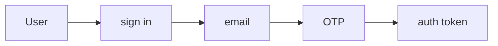
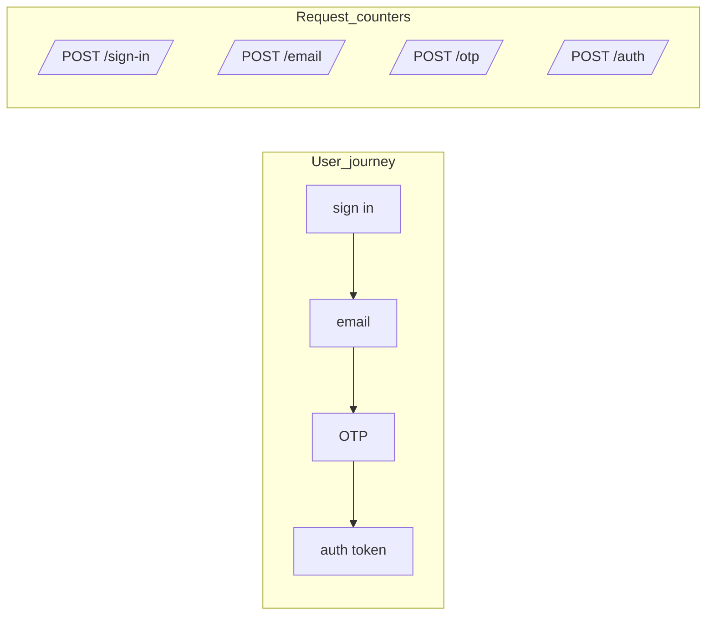
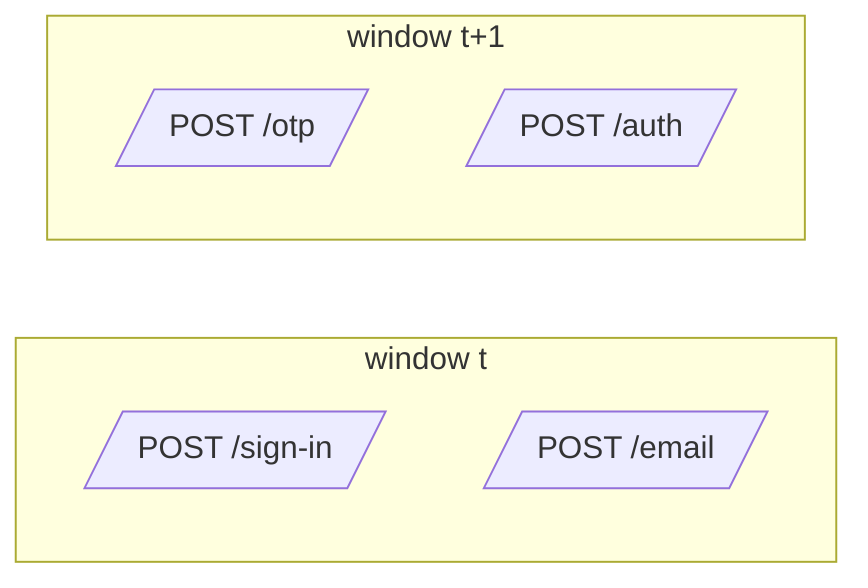

# Journey metrics: flows, users, and requests

This document is a **story-first intro** to Journey Metrics.
It uses a concrete auth example to show:
- what the user is doing
- what the server is doing
- what **requests** we actually count
- how time windows turn this into metrics

The second half, from [Core idea](#core-idea) on, adds the math, 21 plots, window sizing in depth, and a worked OAuth2 example.

## 1. The journey: user and server

Consider a multi-step authentication flow:



The user signs in, receives an email with a one-time password (OTP), enters the OTP, and gets an auth token.

At each step, the user can:
- continue
- stop
- retry
- wait

A long wait and a stop look the same to the metrics until the user comes back. Section [3.4](#34-user-behavior-abandonment-and-retry) covers what that means.

From the server's perspective, each request ends in one of a few buckets:
- **continue (2xx)**: move the user to the next step.
- **retry (429, 502, 503, 504)**: a transient problem. The client or user can try the same step again.
- **fix or stop (most other 4xx: 400, 401, 403, …)**: the request itself was wrong, for example a mistyped OTP. The user either corrects it and retries, or gives up.
- **stop (other 5xx)**: a server-side failure. The journey usually ends here, unless the user starts over.

## 2. What we count: requests

What we actually measure in Journey Metrics is **requests per step** per window, not per-user state.

- per-user: one state machine from "sign in" to "auth token"
- per-request: separate counters, one per endpoint, that know nothing about each other



The user journey is connected; the counters are not. We never link a request at `/otp` to the request at `/sign-in` that came before it. The connection only comes back when we compare counts in the same time window.

Decide two things up front, and keep them consistent:
- **Which requests count at each step.** Either every request to the step's endpoint, or only the successful (2xx) ones. Counting every request makes a step's own errors part of the next transition ratio. Counting only 2xx makes each ratio "successful arrivals here per successful arrival at the previous step". The [OAuth2 example](#real-world-example-oauth2-device-authorization-grant) counts successful requests.
- **The final step counts only successes.** Otherwise a failed `/auth` request would count as a completed journey.

## 3. Time and windows

So far we looked at **one** user or **one** request.
In production we have **many** requests, all the time, from many users.

To make this measurable and alertable we:
- pick a window size (for example 1, 5, or 15 minutes)
- group all requests into these windows
- count how many requests hit each step inside each window

As a guideline, the window should be **much bigger than the time between steps**. [Part 5](#part-5-window-sizing) explains why and shows what goes wrong otherwise.

### 3.1 Concrete example: window size

Suppose your auth flow has these typical timings:
- sign in → email: 2 seconds (server processing)
- email → OTP entry: 15 seconds (user checks email, copies code)
- OTP → auth token: 1 second (server validation)

Average journey time: ~18 seconds; p95 might be ~30 seconds.

A journey that starts near the end of a window finishes in the next one:



The share of journeys split like this is roughly **average journey time ÷ window**:
- **15-second windows**: more than one boundary per journey, on average. Most journeys are split.
- **1-minute windows**: about 30% of journeys are split.
- **5-minute windows**: about 6% are split.

Splitting doesn't make the ratios wrong on average. In steady traffic, journeys leaving a window are replaced by journeys arriving from the previous one. But the ratios get **noisier**, and they get **misleading when traffic changes**: when sign-ins ramp up, the OTP step still sees the traffic of a few seconds ago, so the ratio reads low. When traffic falls, it reads high, sometimes above 100%. The more journeys are split, the bigger the effect.

For this flow, a 5-minute window works well. The rule of thumb is window ≥ **5–10× the average time between steps** for a transition ratio, and 5–10× the average **whole-journey** time for end-to-end conversion.

### 3.2 Concrete example: volume matters

The same 5-minute window behaves differently at different traffic levels. Assume a true success rate of 90%, and count the successes in each window:

**Low traffic (100 sign-ins per 5 minutes)**:
- You'd expect ~90 successes.
- Sampling noise alone puts 95% of windows between about 84 and 96.
- That's ±6 percentage points just from randomness.
- Hard to distinguish a real 5-point drop from noise.

**High traffic (10,000 sign-ins per 5 minutes)**:
- You'd expect ~9,000 successes.
- 95% of windows fall between about 8,940 and 9,060.
- That's ±0.6 percentage points.
- A real 5-point drop (down to 8,500) is unmistakable.

This is why the approach works better at higher volume: sampling noise shrinks as volume grows. These ranges assume each request succeeds or fails independently. Real systems also have variation that more volume doesn't remove ([Part 3](#part-3-real-world-variabilityjitter)).

### 3.3 Window selection strategy

For production systems:

1. **Measure your flow timing first**: use traces or logs to get the average time between each pair of steps, and the average whole-journey time.
2. **Pick the window**: 5–10× the average journey time for `C(t)`. Inner steps with short gaps can use shorter windows.
3. **Check traffic volume**: aim for at least 100 sign-ins per window; 1,000+ is better.
4. **If volume is too low**: use larger windows (15–30 min) or accept that you're monitoring trends, not real time.
5. **Trade-off**: larger windows mean less noise but slower detection.

### 3.4 User behavior: abandonment and retry

Real users don't follow perfect linear paths. Here's how common patterns affect the metrics:

**Abandonment (user stops mid-flow)**:
- User gets to step 2, gets distracted, never continues.
- Metrics: request counted at step 2, but never at step 3.
- Effect: lowers the step 2→3 transition ratio.
- This is **correct behavior**: abandonment should show up as lower conversion.

**Long wait (user comes back after the window closes)**:
- In the window where they stopped, the user looks like an abandonment.
- When they come back, their next request lands in a later window without a matching earlier step.
- In steady traffic these cancel out. It's one more reason to size windows to the journey.

**Quick retry (user mistyped the OTP)**, counting every request:
- User submits the OTP, gets a 401, immediately retries, succeeds.
- Metrics: 2 requests at the OTP step, 1 request at the next step. (If you count only 2xx, the 401 isn't counted and the retry is invisible.)
- Effect: the OTP → auth token ratio is 50%.
- This measures **the share of attempts that move on to the next step**, not "users who eventually succeed". A user who needs three tries counts as 1 in 3.

**Slow retry (user comes back tomorrow)**:
- User tries step 1 today, gives up.
- User tries step 1 again tomorrow, succeeds through to the end.
- Metrics: two separate attempts in two unrelated windows. Today's counts as a failure, tomorrow's as a success.

**What this approach measures**: **"what fraction of requests successfully progress to the next step"** in a given window, including retries. It doesn't track per-user success over unbounded time. That keeps the implementation simple and cheap, and retry storms and other operational issues show up in it naturally. The question it answers is "is the login flow healthy right now?", not "did user X eventually succeed?".

For per-user success tracking over days or weeks, funnel or event analytics tools are a better fit.

## 4. From flows to metrics

Once we have windows, for every window `t` we can say things like the following (counting every request at each step, and only successful requests at the final step):

- `A_1(t)`: how many requests hit `/sign-in` in this window
- `A_2(t)`: how many requests hit `/email` in this window
- `A_3(t)`: how many requests hit `/otp` in this window
- `A_4(t)`: how many requests hit `/auth` and succeeded in this window (the final step, `A_S`)

From these **counts per step, per window** we can build:

- **Transition ratios**: `T_i(t) = A_{i+1}(t) / A_i(t)` — what fraction of requests at step `i` made it to step `i+1`
- **End-to-end conversion**: `C(t) = A_S(t) / A_1(t)` — what fraction of starting requests reached success

Because each window counts whatever arrives in it, a `T_i(t)` can occasionally exceed 1, for example when traffic drops and the next step is still receiving journeys that started earlier.

### 4.1 What these metrics tell you

**Per-step transition ratio `T_i(t)`**:
- "Of the requests that reached step `i`, what % made it to step `i+1`?"
- In our experience, healthy auth flows often see 85–95% per step (some abandonment and retries), but your baseline will depend on your specific flow.
- A drop below your baseline points at step `i`, or at something between `i` and `i+1`.

**End-to-end conversion `C(t)`**:
- "Of all requests that started the flow, what % completed it?"
- This is the product of all transition ratios: `C(t) = T_1(t) × T_2(t) × T_3(t) × ...`
- If any step fails, `C(t)` drops.

**SLI and SLO**: `C(t)` is the measurement. Over a longer period, the **flow SLI** is total successes over total starts, `ΣA_S / ΣA_1` ([Advanced notes](#advanced-notes-optional)). The **SLO** is the target you set on top of it, either:
- volume-weighted: "SLI ≥ 75% over 30 days", or
- window-based: "99% of 5-minute windows have C(t) > 70%".

Set the target from your observed baseline, not from a round number. Three steps at 90% each already give 73%, so a 70% target would leave almost no headroom.

### 4.2 Operational use

Once you have `C(t)` calculated for each window:

1. **Dashboard**: plot `C(t)` over time with control limits ([Part 2](#part-2-volume-matterssampling-noise-vs-signal)).
2. **Alert**: fire if `C(t)` drops below a threshold for N consecutive windows.
3. **Debug**: check which `T_i(t)` dropped to find the broken step.
4. **SLO**: track the SLI against its target over a month.

Example alert rule (pseudo-config):

```text
alert: AuthFlowDegraded
when:  auth_flow_conversion < 0.70 for 2 consecutive 5-minute windows
# healthy baseline for this flow ≈ 0.85
```

A fixed threshold is the simplest start. Control limits from a healthy baseline adapt the threshold to your actual noise; [alerts.md](alerts.md#threshold-patterns-by-metric-type) shows how to set them for journey conversion.

## 5. When this approach fits

### 5.1 Good fit

- **Steps are mostly sequential**: login → MFA → token → success.
- **Step timing is bounded**: journeys take seconds to minutes, not hours.
- **Volume is moderate to high**: at least 100 requests per window, ideally 1,000+.
- **You want operational SLIs**: "Is the login flow healthy right now?"
- **Cost matters**: aggregate counters are cheaper than per-user events.

### 5.2 Other approaches are better

- **Long async steps**, such as email verification that takes hours or days. Windows would need to be very large (1 day+), making detection slow. Use event-based tracking ([events.md](events.md)).
- **Very low traffic**, under ~100 requests per window. Sampling noise makes the ratios jump around. Use longer windows, or synthetic monitoring plus event tracking.
- **Complex branching**, with lots of optional paths and loops. It can still work, but you need a separate flow for each major branch, for example `flow=login_password`, `flow=login_sso`, `flow=login_webauthn`.
- **Per-user analysis**, such as "show me all users who failed step 2". This approach has no user IDs. Use tracing or event analytics ([events.md](events.md)).
- **Attribution across long time spans**, such as "of users who signed up last month, how many completed setup?". That's a funnel or cohort question, not an operational health question. Use product analytics tools.

### 5.3 Combining tools

Journey Metrics is the cheap operational signal: SLIs, alerts, dashboards. In our experience, it works best next to tracing for debugging specific failures, product analytics for longer-term conversion and A/B tests, and synthetic checks for baseline health. [Existing approaches](#existing-approaches-and-alternatives) compares them.

---

## Core idea

Funnel tools are great for product analytics, but for SLOs and alerts we found them tricky—they need user tracking, custom events, and can get expensive.

This approach uses **aggregate request counts only**:
- Count requests per step per window (no user IDs)
- Compute ratios between steps
- Monitor with control charts

This gives you:
- Low cardinality metrics (cheap)
- Simple math
- Easy integration with standard metrics backends

## Concepts and notation

We work with time windows (for example, 1, 5, or 15 minutes). For each window $t$:

- **Step** $i$: a state in the auth journey ("login form", "OTP page", "/authorize", etc.).
- **Arrival** $A_i(t)$: number of requests entering step $i$ in window $t$.
- **Transition ratio** $T_i(t)$: fraction of requests that move from step $i$ to step $i+1$:
  $$T_i(t) = \frac{A_{i+1}(t)}{A_i(t)}.$$
- **Success step** $S$: the last step, with a clear success condition (for example a final HTTP 2xx). Only successful requests count towards $A_S(t)$.
- **Conversion** $C(t)$: ratio of requests in window $t$ that reached the success step to requests that entered step 1 in the same window:
  $$C(t) = \frac{A_{S}(t)}{A_1(t)} = \prod_{i=1}^{S-1} T_i(t).$$

Notes:
- We count **requests**, not unique users. Retries are part of the signal, so this is a request-level measure, not a per-user funnel.
- Ratios $T_i(t)$ and $C(t)$ are volume-agnostic, but their **noise** shrinks with more traffic.
- Because each window counts whatever arrives in it, a measured $T_i(t)$ can occasionally exceed 1 (see [Part 5](#part-5-window-sizing)).

**Assumptions**
- Steps are sequential (like `/login -> /otp -> /success`).
- The average time between steps is small compared to the window (see [Part 5](#part-5-window-sizing)).
- There is enough traffic that individual requests don't dominate the signal.

---

## Example: 4-step auth flow

Example flow:

> Step 1 → Step 2 → Step 3 → Step 4 → Success

For a window $t$:
- $A_i(t)$: arrivals into step $i$, for $i ∈ \{1,2,3,4,5\}$, where step 5 is the success step.
- $T_i(t) = A_{i+1}(t)/A_i(t)$ for $i ∈ \{1,2,3,4\}$.
- End-to-end conversion:
  - $C(t) = A_5(t)/A_1(t)$
  - $= \bigl(A_2(t)/A_1(t)\bigr)\cdot\bigl(A_3(t)/A_2(t)\bigr)\cdot\bigl(A_4(t)/A_3(t)\bigr)\cdot\bigl(A_5(t)/A_4(t)\bigr)$
  - $= T_1(t)\cdot T_2(t)\cdot T_3(t)\cdot T_4(t)$

Interpretation:
- Any drop in any $T_i(t)$ shows up as a drop in $C(t)$.
- $C(t)$ is a single SLI-style number that captures the whole journey.
- You still keep normal per-endpoint SLIs (success rate, latency); $C(t)$ sits on top as the flow SLI.

See [src/metrics_demo.py](src/metrics_demo.py) for code that generates the example plots ([how to regenerate them](README.md#refresh-visualizations)).

---

## Visualizations

We'll start with basic concepts, then explore how **volume**, **jitter**, and **failures** affect the signal.

Parts 1–4 use the 4-step flow above with 90% success on the first three transitions ($T_1 = T_2 = T_3 = 0.9$) and $T_4 = 1.0$, giving $0.9^3 ≈ 73\%$ end-to-end conversion.

### Part 1: Basic concepts—what are we measuring?

These first plots show the building blocks: arrivals, transitions, and conversion.

#### 1.1 Arrivals per step – healthy flow


We start with 1,000 requests at Step 1 and count how many reach each later step. With 90% success per step, the numbers fall off gradually: Step 1 → 1,000, Step 2 → 900, Step 3 → 810, Step 4 → 729, Step 5 (success) → 729.

#### 1.2 Arrivals per step – broken step


Same starting volume, but $T_2$ (Step 2 → Step 3) drops to 20%. Step 3 onward sees far fewer requests: the "cliff" sits between Step 2 and Step 3 and persists through the rest of the flow.

#### 1.3 Side-by-side comparison


Comparing both scenarios makes the broken step obvious. This is what you'd investigate when $C(t)$ drops: which $A_i(t)$ shows the biggest change?

#### 1.4 Transition ratios


The per-step view: all transitions look healthy except $T_2$, which is exactly where the flow broke.

#### 1.5 End-to-end conversion


The single number you'd track as your flow SLI: 73% healthy → 16% broken. This is what triggers your alert.

---

### Part 2: Volume matters—sampling noise vs. signal

**How does traffic volume affect detection?**

All control limits in Parts 2–4 are individuals-chart limits: mean ± 3σ, with σ estimated from the average moving range of the baseline windows.

#### 2.1 Low volume: 100 requests/window


100 requests per window shows noticeable bounce (sampling noise, σ ≈ 0.04). Control limits need to be wide: about ±0.13.

#### 2.2 Medium volume: 10k requests/window


10k requests: much smoother, tighter limits (about ±0.01). Good operating range for most production flows.

#### 2.3 High volume: 1M requests/window


1M requests: nearly flat (limits about ±0.001). Even tiny degradations are obvious.

Sampling noise shrinks with $1/\sqrt{n}$: 100× the traffic gives 10× tighter limits.

---

### Part 3: Real-world variability—jitter

Production systems have real variation: performance fluctuations, time-of-day effects, load changes. We model this as **jitter**: in each window, each $T_i$ is drawn uniformly from $T_i ± 0.05$ (5 percentage points). $T_4 = 1.0$ can't go higher, so it stays fixed.

**Does higher volume eliminate this variation?**

#### 3.1 Timing noise in a single transition


Before looking at full flows, here is a single transition $T_1(t)$ measured in 1-minute windows, where the average gap between the two steps is also 1 minute. Three volume levels (20, 200, 2000 requests/min) all have the same true success rate (90%, dashed line). At low volume the measured ratio swings from about 0.5 to 1.5.

Part of that is ordinary sampling noise. Most of it is **timing noise**: with the window as short as the gap, most step-2 requests in a window started step 1 in an earlier window. $A_1(t)$ and $A_2(t)$ are counting mostly different requests, so their random fluctuations don't cancel out. More volume or [bigger windows](#part-5-window-sizing) both fix this.

#### 3.2 Low volume with jitter


With 100 requests per window and jitter on each step, $C(t)$ varies more: σ goes from 0.04 (Part 2.1) to about 0.07. The mean stays around 73%, but individual windows range widely. Control limits have to be wide to cover this real variation.

#### 3.3 High volume with jitter—same problem persists


Same flow, same jitter, but with 1M requests per window. The mean is still ~73%, but **the control limits barely tighten**. Without jitter, going from 100 to 1M requests shrank the limits from ±0.13 to about ±0.001. With jitter they only shrink from about ±0.20 to ±0.12. The variation is still there because it's real: each window really does have a different success rate.

Volume reduces **sampling noise**, not **real variation**. If your system genuinely fluctuates by a few points per window, that persists at any scale.

#### 3.4 What can you do about jitter?

Options:
- **Bigger windows**: 15-30 min instead of 5 min (slower detection)
- **Moving averages**: smooth the signal (adds lag)
- **Wider thresholds**: require sustained degradation to alert
- **Fix the source**: improve system stability (best long-term)

#### 3.5 Moving average control limits


Same scenario as 3.3, but we alert on a 5-window moving average (blue) instead of raw values (gray). The average of $w$ windows has $\sqrt{w}$ times less variation, so its limits are $\sqrt{5} ≈ 2.2×$ tighter: about ±0.055 instead of ±0.12. A smaller sustained drop is now enough to cross them.

Compute σ from the **raw** values and divide by $\sqrt{w}$. Don't compute it from the moving ranges of the average itself: neighbouring averages share 4 of their 5 inputs, so they barely move from one window to the next, and the limits come out far too tight and fire on healthy traffic.

The cost is lag. A 5-window average reacts to a sudden drop with about 2 windows of delay on average, and shows the full drop only after 5 windows (50 minutes with 10-minute windows).

---

### Part 4: Detecting real failures

After 40 healthy windows, we inject a failure from window 41: $T_2$ drops from 0.9 to 0.8.

#### 4.1 Low volume: 100 requests


Detectable but noisy. You'd want multiple bad windows before alerting.

#### 4.2 High volume: 1M requests


Immediately obvious. Every post-failure window would trigger.

Failures are detectable at any volume, but high volume makes detection cleaner.

---

### Part 5: Window sizing

The most common mistake is a window that is too small for the flow. The ratios still work, but they get noisy, and they mislead whenever traffic changes.

#### 5.1 Why window size matters

Each window counts whatever arrives in it. A request that enters step $i$ just before a window boundary reaches step $i+1$ in the next window. On average, the share of $A_{i+1}(t)$ that started in an earlier window is about

$$\text{spillover} ≈ \frac{\text{average gap between step } i \text{ and step } i+1}{W}$$

where $W$ is the window length. With a 1-minute average gap, that's about 20% for a 5-minute window, and about 7% for 15 minutes.

With steady traffic, spillover into a window is balanced by spillover out of it, so $T_i(t)$ is still correct on average. It's just noisier, because $A_i(t)$ and $A_{i+1}(t)$ share fewer requests (Part 3.1).

With changing traffic, step $i+1$ sees the traffic of one gap ago. When traffic rises, $T_i(t)$ reads low; when it falls, $T_i(t)$ reads high, even above 1. The bigger the spillover, the bigger the error.

It's Little's Law: at any moment, about (arrival rate × average gap) journeys are between two steps. The window has to be long enough that this in-flight group is a small part of what it counts.

#### 5.2 What a too-small window looks like


Nothing is broken here: true $T_1$ is 0.9 throughout. For 15 minutes, step-1 traffic jumps from 200 to 1,000 requests/min (a marketing push, a batch of devices, a bot wave). The average gap between the steps is 1 minute.
- 1-minute windows: $T_1$ dips to about 0.45 as the spike starts (step 1 sees the new traffic first), then jumps to about 3 as it ends (step 2 is still draining the spike while step 1 is back to normal). That looks like a failure and then a recovery above 100%.
- 5-minute windows: the same shape, but smaller: about 0.75, then 1.6.
- 15-minute windows: much smaller: about 0.85, then 1.15.

Signs that your window is too small:
- $T_i(t)$ regularly above 1
- Dips in $T_i(t)$ that line up with rises in $A_1(t)$, and bumps that line up with falls
- A noisy $T_i(t)$ even at high volume, while the same ratio over a larger window is smooth

If per-step counts differ by orders of magnitude (say 1,000 at step 1 and 500,000 at step 2), that is not a window problem. More likely you're counting something else: polling requests, a missing status filter, or an endpoint shared with another flow.

#### 5.3 How to choose window size

As a rule of thumb, make the window **5–10× the average gap between consecutive steps**, which keeps spillover around 10–20%.
- For each $T_i(t)$, use the gap between step $i$ and step $i+1$.
- For $C(t)$, use the average time of the **whole journey**, from step 1 to success, because $C(t)$ compares the first and last steps directly.

If the gaps have a long tail, the average overstates spillover: a user slower than the window can only spill into the next window once. Size the window from the bulk of journeys (for example the median plus a margin) rather than from the tail.

**Example: OAuth2 device flow** (the [real-world example](#real-world-example-oauth2-device-authorization-grant) below)

Break the flow down by step:
- Step 1→2: user opens a browser after seeing the device code (average ~1 minute, p95 ~3 minutes)
- Step 2→3: user types the code and authorizes (~30 seconds)
- Step 3→4: device polls and gets the token (a few seconds, one polling interval)
- Step 4→5: device uses the token for an API call (seconds)

The whole journey averages about 1.5–2 minutes. Using the 5–10× rule:
- 1-minute window: too small. With the window as short as the gap, the formula above breaks down; for this gap distribution, about 60% of step-2 requests started in an earlier window.
- 5-minute window: fine for $T_2$–$T_4$, which have short gaps. Borderline for $T_1$ (about 20% spillover) and $C(t)$ (30–40%), which shows up as noise and as errors during traffic ramps.
- 10–15-minute window: good for $T_1$ and $C(t)$. This is what the example below uses.

You can also use different windows per ratio: short windows for fast inner steps, longer for $T_1$ and $C(t)$.

#### 5.4 How to validate

Plot $T_i(t)$ at two window sizes (say 5 and 15 minutes) over a day with a traffic ramp. If the smaller window shows dips during ramp-ups, bumps during ramp-downs, or values above 1 that the larger one doesn't, the smaller window is too small.

For flows with long or variable gaps (email verification over hours, human review, async jobs), a window long enough to contain the journey makes this a slow, laggy signal. Use event-based funnels instead (see [events.md](events.md)).

---

## Real-world example: OAuth2 Device Authorization Grant

Let's apply this to a real authentication flow: the OAuth2 Device Authorization Grant ([RFC 8628](https://datatracker.ietf.org/doc/html/rfc8628), the "device flow"), used by smart TVs, CLI tools, and IoT devices.

### The flow

**Step 1**: Device requests a device code  
→ `POST /device_authorization` returns `device_code` and `user_code`

**Step 2**: User visits the verification URL  
→ User opens a browser and navigates to the `verification_uri`

**Step 3**: User enters the code and authorizes  
→ User types the `user_code`, reviews permissions, grants access

**Step 4**: Device polling succeeds  
→ Device polls `POST /token` and receives valid tokens

**Step 5 (success)**: Device has a working access token  
→ First API call with the token succeeds

### Metrics for a 10-minute window

For each window $t$, we count **requests** at each step (10 minutes follows [the rule above](#53-how-to-choose-window-size)):
- $A_1(t)$: number of `POST /device_authorization` requests
- $A_2(t)$: number of verification page GET requests (HTTP 200)
- $A_3(t)$: number of successful authorization POST requests (consent granted)
- $A_4(t)$: number of `POST /token` requests that return valid tokens (HTTP 200 with token). Pending polls (`authorization_pending`) are not counted, or they would swamp this step.
- $A_5(t)$: number of requests to protected resources that succeed with these tokens

Transitions:
- $T_1(t) = A_2(t)/A_1(t)$: verification page loads per device auth request
- $T_2(t) = A_3(t)/A_2(t)$: successful authorizations per verification page load
- $T_3(t) = A_4(t)/A_3(t)$: token retrievals per authorization grant
- $T_4(t) = A_5(t)/A_4(t)$: successful API calls per token retrieval

End-to-end conversion:
$$C(t) = \frac{A_5(t)}{A_1(t)} = T_1(t) \cdot T_2(t) \cdot T_3(t) \cdot T_4(t)$$

A user who restarts the flow generates another device auth request, so retries show up in $A_1(t)$ and lower $C(t)$. This measures "what fraction of requests successfully progress", not a per-user completion rate over unbounded time.

### Typical healthy values

- $T_1 \approx 0.95$ (most device auth requests lead to verification page loads)
- $T_2 \approx 0.85$ (some verification page loads don't result in authorization completion)
- $T_3 \approx 0.98$ (authorization grants reliably lead to token retrieval)
- $T_4 \approx 0.99$ (tokens usually work for API calls)
- Overall $C \approx 0.78$ (~78% of device auth requests result in successful API calls)

### What this catches

If $T_2$ drops from 0.85 to 0.70:
- Per-endpoint monitoring shows all endpoints returning HTTP 200
- But $C$ drops from $0.95 \times 0.85 \times 0.98 \times 0.99 = 0.78$ to $0.95 \times 0.70 \times 0.98 \times 0.99 = 0.65$ (65%)
- This signals that fewer requests are completing the flow, even though each individual endpoint succeeds

This catches issues like broken verification URLs, confusing UX, or timing problems that per-endpoint success rates miss.

### Scenarios

The scenarios below show how different kinds of change affect the flow metrics. Each window has 10k device auth requests unless the traffic follows a daily cycle, and each $T_i$ jitters by ±0.02 (narrowed near 1, so $T_4 = 0.99$ only jitters by ±0.01). Degradations start at window 21, after 20 healthy windows.
- Scenarios 1, 4 and 5 alert on a 5-window moving average, with limits computed as in [Part 3.5](#35-moving-average-control-limits).
- Scenarios 2 and 3 have a daily traffic cycle and use **volume-aware limits**: a p-chart, whose limits depend on each window's volume, plus the real variation measured in the healthy baseline.

#### Scenario 0: Volume independence


Traffic varies 20× (500→10k→500 req/window), yet $C(t)$ stays ~78%. Volume affects **noise**, not **signal**—this is why ratios work across scales.

#### Scenario 1: User behavior change — T1 drops


$T_1$ drops from 0.95 to 0.80 at window 21. Likely a UX issue (broken link, confusing instructions). The moving average crosses the lower limit in the first bad window and settles around 66%.

#### Scenario 2: System failure with seasonal traffic — T2 drops


Daily traffic pattern with $T_2$ degrading at window 21. The limits are fixed from the healthy baseline, so every bad window stays below them. Limits recomputed from a rolling window would slowly absorb the failure and the alert would clear itself.

#### Scenario 3: Seasonal pattern — healthy flow


Daily cycle, healthy throughout. The limits widen at night (about ±0.08 at 500 requests/window) and tighten at peak (about ±0.06 at 10k). At peak (10k requests), sampling noise (σ ≈ 0.004) is small next to the real variation from the ±0.02 jitter per step (σ ≈ 0.02), so the jitter sets the width. At night (500 requests) the two are about equal, which is why the limits widen by about a third, not more. As in Part 3, past a certain volume more traffic stops tightening the limits.

#### Scenario 4: Polling failure — T3 drops


$T_3$ drops from 0.98 to 0.85. Polling timeouts or rate limiting.

#### Scenario 5: Token validation — T4 drops


$T_4$ drops from 0.99 to 0.90. Tokens issued but fail on API calls.

---

## Advanced notes (optional)

Notes for rolling this out in production.

**Volume, variance, and windows**
- Ratios are mathematically volume-agnostic, but sampling noise shrinks with more traffic. Real variation does not ([Part 3](#part-3-real-world-variabilityjitter)).
- With very low arrivals per window, $T_i(t)$ and $C(t)$ are noisy. Use larger windows, require multiple bad windows before paging, or use a different tool (funnels, events).
- Window size: see [Part 5](#part-5-window-sizing).

**Control charts**
- Individuals chart: simple, works when volume per window is roughly stable.
- P‑chart: limits widen at low volume and tighten at high volume. On its own it assumes sampling noise is the only noise, so at high volume it fires on normal jitter. Add the real variation from a healthy baseline (Scenario 3, or a Laney p′ chart).
- Keep limits fixed from a known-good period and update them occasionally as the system evolves. Limits recomputed continuously from recent data drift towards an ongoing failure.
- Instead of control charts, you can use simple alert rules (for example static SLO-style thresholds on $C(t)$) or the built-in anomaly detection / forecasting in your metrics backend, with the same $T_i(t)$ and $C(t)$ as inputs. [alerts.md](alerts.md#threshold-patterns-by-metric-type) shows how to set one for journey conversion.

**Non-linear flows**
- In practice each major branch is its own mostly sequential flow, tagged `flow=<journey>_<method>` (for example `flow=login_password`, `flow=login_sso`, `flow=login_webauthn`).
- For loops and retries, you can usually treat retries as extra noise in $A_i(t)$ and $T_i(t)$; with enough traffic they average out and a retry storm will show up as a drop in $C(t)$. Split out first attempts vs retries only if you need to distinguish "hard failures" from "eventual success after many retries".

**SLIs, SLOs, and cost**
- Typical stack: per-endpoint availability + latency **and** flow conversion $C(t)$.
- A practical flow SLI is the volume-weighted mean conversion over a period $P$: $\text{SLI}_\text{flow}(P) = \frac{\sum_t A_1(t)\,C(t)}{\sum_t A_1(t)} = \frac{\sum_t A_S(t)}{\sum_t A_1(t)}$. Under the assumptions above, this approximates the fraction of attempts that eventually succeed.
- The SLO is the target on top of it, for example "SLI ≥ 75% over 30 days". [Section 4.1](#41-what-these-metrics-tell-you) shows a window-based alternative ("99% of windows above X").
- Per-step SLOs locate the broken component; end-to-end conversion SLOs say whether the journey works.
- A small, controlled `flow` tag adds predictable metric cardinality and is usually cheap in managed backends ([dashboards.md](dashboards.md#tagging-and-cardinality)).

**Traffic mix, bots, and abuse**
- Not all arrivals are equal: some traffic comes from real users, some from automated clients, some from abusive sources. All of it contributes to $A_i(t)$, $T_i(t)$, and $C(t)$.
- If the mix is **stable**, its effect is baked into your baseline and limits.
- When abuse/bot traffic surges, you often see $A_1(t)$ spike and transitions drop.

## Other applications of this method

- **API rate limiting and retry policies**: track end-to-end success including retries; detect when rate limits are too aggressive or retries mask degradation.
- **Payment processing flows**: measure checkout-to-settlement conversion; catch revenue leaks where per-endpoint metrics show success but customers don't complete payment.
- **CI/CD pipelines**: reveal the real deployment success rate. Five stages at 98% each give only 90% end-to-end.
- **Data ingestion pipelines**: detect when data arrives but doesn't fully propagate through validation, transformation, and caching.
- **Service mesh / distributed systems**: catch cross-service conversion drops that per-service SLIs miss due to cascading timeouts or retries.
- **Email delivery pipelines**: measure accepted → delivered, beyond "accepted by SMTP"; detect ISP blocking and spam filtering. This works when the stages complete within minutes, not when you're waiting on a human to open the email.

## Existing approaches and alternatives

This builds on **Google SRE's journey-based SLIs** ([SRE Workbook](https://sre.google/workbook/implementing-slos/#modeling-user-journeys)) and **Statistical Process Control** from manufacturing. Not reinventing anything—just tying together journey SLIs, SPC, and standard metrics backends, with concrete math and guidance.

### Comparison with existing tools

| Approach | How it works | What it is best at | Main tradeoffs |
|---|---|---|---|
| Real User Monitoring / Funnels | Client events per user/session, queried as funnels | Product analytics, paths, cohorts, UX questions | Needs identity, higher cost, awkward for SLOs |
| Synthetic monitoring | Bots run scripted journeys | Smoke tests, external checks, third parties | Fake traffic, limited scenarios, no load info |
| APM / distributed tracing | Per-request traces across services | Deep debugging of specific failures | High cardinality, sampling, complex queries |
| High-cardinality observability ([events.md](events.md)) | Stores rich, high-cardinality events and fields | Ad-hoc "show me all requests where…" queries | Cost grows with cardinality and usage |
| This **Journey Metrics** model | Aggregate request counters per step and time window | Cheap, simple flow SLIs and SLOs | Less flexible for arbitrary ad-hoc questions |

**When to use what:**
- **RUM/Funnels**: Product analytics, user segmentation
- **Synthetic monitoring**: Smoke tests, uptime checks
- **APM/Tracing**: Debugging specific failures
- **High-cardinality**: Exploratory analysis
- **Journey Metrics**: Cheap flow SLOs and alerts

---
