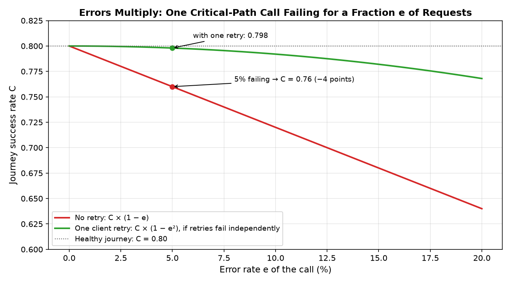
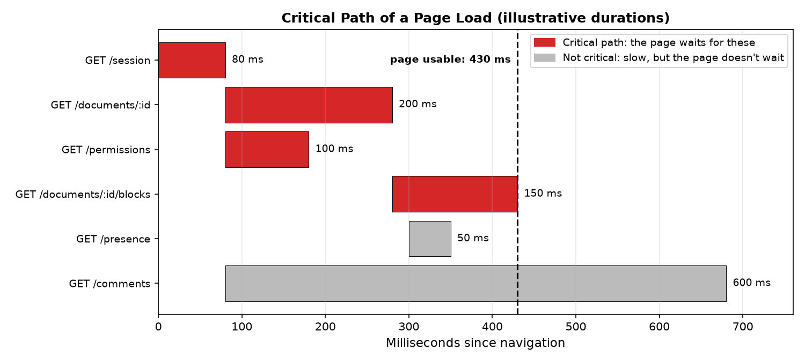

# KPIs: what to measure

Use this to choose a product's KPIs and connect each one to the journeys, API calls and resources beneath it. Next: [dashboards.md](dashboards.md) (what to build), [alerts.md](alerts.md) (what to page on), [analysis.md](analysis.md) (is a change real).

## Glossary

Used across all four references.

| Term | Meaning |
|---|---|
| Journey | Ordered user steps ending in a visible success (log in, edit and save, publish). Tagged `flow` in metrics. |
| $A_i(t)$, $T_i(t)$, $C(t)$ | Per time window $t$: arrivals at step $i$; step transition $A_{i+1}/A_i$; journey success rate $A_S/A_1$ ([Level 2](#level-2-journey-kpis)). [flows.md](flows.md) calls $C(t)$ "conversion"; here *conversion* means only the business KPI (free → paid). |
| SLI | Service level indicator: the fraction of good events, e.g. successful requests, requests faster than 500 ms, journeys that succeed. |
| SLO | Target for an SLI over a period, e.g. "99.9% of requests succeed over 30 days". |
| Error budget | The bad events an SLO allows: $1 -$ target. Burn rate = how fast it's being used ([alerts.md](alerts.md#slo-burn-rate-alerts)). |
| RED / USE | Per request-driven call: Rate, Errors, Duration. Per resource: Utilization, Saturation, Errors. |
| RUM | Real user monitoring: measurements taken in users' browsers or apps. |
| p75, p95, p99 | Percentiles: 75%, 95%, 99% of values are below. p75 for user experience (Core Web Vitals), p95/p99 for tails and alerts. |
| μ, σ | Mean and standard deviation, measured over healthy (baseline) data. |
| Control limits | μ ± 3σ of a metric in healthy windows; outside = unusual ([alerts.md](alerts.md#threshold-patterns-by-metric-type)). |
| Points | Percentage points: 80% → 75% is a 5-point drop. |
| Critical path | The calls a step can't complete without; the user waits for them. |
| Wide events | One structured event per request with all its context ([events.md](events.md)). |

## The KPI tree

```text
Level 1  Business KPIs      activation, engagement, conversion, retention     days-weeks, lagging
             ↑ driven by
Level 2  Journey KPIs       journey success rate, journey latency, volume     minutes, leading   ← the bridge
             ↑ composed of
Level 3  API call SLIs      rate, errors, latency per call, as users see them minutes, leading
             ↑ limited by
Level 4  Resources          database, workers, queues, caches, third parties  seconds-minutes
```

- Each KPI sits at one level; the level below explains it.
- Business KPI moved but no journey KPI did → not a reliability problem (look at product changes, marketing, seasonality).
- Journey KPIs are the link: fast enough to alert on, meaningful to the business. Business KPIs are too slow and noisy to alert on; API calls mean little to the business alone.

| Level | Reacts in | Use for |
|---|---|---|
| 1 Business KPIs | Days–weeks | Reporting, prioritisation, sizing incident impact |
| 2 Journey KPIs | Minutes | Alerts, SLOs, incident impact |
| 3 API call SLIs | Minutes | Alerts, diagnosis |
| 4 Resources | Seconds–minutes | Diagnosis, capacity |

## Level 1: Business KPIs

Outcomes the business cares about. Slow, and driven by much more than reliability.

| KPI | Definition | Typical window |
|---|---|---|
| Acquisition | New sign-ups per day | Daily, weekly |
| Activation rate | Share of new accounts that complete the key action (the "aha" moment) within N days | Weekly cohorts |
| Engagement | Active users (DAU, WAU) and key actions per active user | Daily, weekly |
| Conversion | Share of free or trial accounts that become paying | Monthly cohorts |
| Retention | Share of a cohort still active N weeks later; churn is the inverse | Weekly, monthly |
| Revenue | Recurring revenue, expansion, contraction | Monthly |

- Pick 3–5.
- For each, name its **key action**: what a user must do for the KPI to move ("published their first site", "invited a teammate"). The key action is a journey (level 2).
- Segment only by bounded dimensions: plan tier, platform or client, region, new vs returning.

## Level 2: Journey KPIs

- **Journey**: ordered user steps ending in a visible success. Examples: sign up, log in, load the app, edit and save, publish, view a page, search, pay.
- Each step is backed by one or more API calls.
- Notation, per time window $t$: $A_i(t)$ = requests arriving at step $i$; step $S$ = the success step (count only successful requests there).
- **Count each step once per attempt.** Calls that repeat within one attempt (autosave sends many `PUT`s per document open; polling; client retries) inflate $A_i$ and can push $C$ above 1. For those steps, count a once-per-attempt signal instead: the first successful save per edit session, or a "saved" event.
- **Keep journeys short.** $C(t)$ needs windows 5–10× the journey's average duration ([analysis.md](analysis.md#windows)). An editing session of tens of minutes would need hour-long windows → a slow signal. Split it into short journeys (open → editable; save → saved) and alert on those.

| KPI | Formula | Answers |
|---|---|---|
| Journey success rate | $C(t) = A_S(t) / A_1(t)$ | "Does the journey work right now?" |
| Step transition | $T_i(t) = A_{i+1}(t) / A_i(t)$ | "Which step broke?" |
| Journey volume | $A_1(t)$ | "Can users start?" A drop = users can't reach step 1, or demand fell |
| Journey latency | First step to success, p75 and p95, from RUM or traces | "Is it slow enough that people give up?" |
| Journey SLI | $\sum_t A_S(t) / \sum_t A_1(t)$ over 30 days | SLO reporting, error budget |

Counters and window sizing: [flows.md](flows.md) (introduction, then the math and plots).

Choosing journeys:
1. Start from each business KPI's key action; list the journeys a user must complete to reach it.
2. Rank by traffic × business value. Login and "load the main screen" usually come first, because every other journey depends on them.
3. Start with 3–5. For each, write: ordered steps, the API call(s) behind each step, what counts as success.

## Level 3: API call SLIs

RED per call: **R**ate, **E**rror rate, **D**uration (p50, p95, p99).

### Measure where the user is

| Vantage point | Sees | Misses |
|---|---|---|
| **Browser / client** (RUM, frontend SDK) | Real latency including network; client errors; calls that never reach you (DNS, CORS, blocked, offline, timeouts) | What happened inside the server |
| **Edge / CDN** | Every request that reaches you; status; edge vs origin time; cache hits | Failures before the edge; what happens inside the origin |
| **Server** (traces, logs, APM) | Handler time, errors, dependency calls | Queueing before the server, network, the client |

- SLIs from the client or edge; diagnosis from the server.
- The client–server gap is a signal: client errors the server never logged, or client latency far above server latency → likely a network, edge or frontend problem.

### What counts as an error

Decide per endpoint and write it down.

| Treat as | Status |
|---|---|
| Error, always | 5xx, timeouts, network failures seen by the client |
| Not an error, usually | 4xx for expected user outcomes: wrong password 401, not found 404, validation 400 |
| Track separately | 429 (rate limiting); 4xx spikes that signal a client bug (e.g. a frontend release sending bad requests) |

### Frontend-specific signals

- **Core Web Vitals at p75**, Google's "good" thresholds: LCP ≤ 2.5 s (loading), INP ≤ 200 ms (responsiveness), CLS ≤ 0.1 (layout stability).
- **Calls per page or view**, and which are on the **critical path** (the page isn't usable until they return). Calls that wait on other calls (waterfall depth) add latency.
- **Client retries and timeouts**: success on the third try = success for the server, delay for the user.
- **Payload size** of the heaviest calls.

## Level 4: Resources

USE per resource: **U**tilization, **S**aturation, **E**rrors.

| Resource | Watch |
|---|---|
| Database | Query latency, connections, rows read |
| Workers | CPU, memory, concurrency |
| Queues | Depth, age of the oldest item |
| Caches | Hit rate, evictions |
| Third-party APIs | Their RED |

Resources explain level 3; they're rarely KPIs themselves.

## Connecting the levels: how an API call affects a KPI

### 1. Map it

Write this table for each journey. Dashboards and impact estimates are built on it.

| Journey | Step | API call(s) | Critical path? | Success = |
|---|---|---|---|---|
| Edit and save | Open document | `GET /documents/:id` | Yes | 200 and rendered |
| | Save | `PUT /documents/:id` | Yes | 200 |
| | Presence, comments | `GET /presence`, `GET /comments` | No | — |

- Only critical-path calls can break the journey.
- Non-critical calls degrade it (e.g. a missing comment sidebar) without changing its success rate.

### 2. Estimate the effect on the journey

- **Errors multiply**: $C = \prod T_i$. A critical-path call failing for a fraction $e$ of requests turns $T_i$ into at most $T_i(1-e)$ (less of a drop if the client retries), so $C$ becomes at most $C(1-e)$. Example: $C = 0.80$, $e = 5\%$ → $C = 0.76$, a 4-point drop.
- **Latency adds or maxes**: sequential critical-path calls add up; parallel ones cost the slowest. A slow call off the critical path doesn't slow the journey.
- **Latency becomes errors through abandonment**: users give up on slow steps they're waiting for → lower $T_i$.
  - Measure it: record each attempt's call latency with its outcome (RUM or wide events), bucket the latency (e.g. < 300 ms, 300 ms–1 s, > 1 s), and compare $T_i$ per bucket.
  - Don't assume industry rules of thumb like "100 ms = 1% conversion".
  - Calls the user doesn't wait for (background autosave, prefetch) can't cause abandonment. For those, watch their failures and what they cause instead: unsaved-changes warnings, lost edits, conflicts.



With $C = 0.80$, a critical-path call failing 5% of the time takes the journey to 0.76. One client retry (failing only if both tries fail, $e^2$) keeps it at 0.798, but only if the retry fails independently of the first try. During real incidents failures are correlated, so retries help much less.



Illustrative page load: it's usable at 430 ms = 80 (session) + 200 (the slower of two parallel calls) + 150 (blocks, which waits for the document). Both parallel calls block the page, but only the slower one sets the time: `/permissions` has 100 ms of slack. The 600 ms comments call ends later but doesn't delay "usable".

### 3. Estimate the effect on the KPI

- **Failed journeys** ≈ $A_1$ per hour × drop in $C$ × duration.
  - Example: 10,000 journey starts/h × 5 points × 2 h = 1,000 failed journeys.
- **Business impact** = failed journeys × share that never comes back and succeeds.
  - Measure that share from past incidents, if you can link retries to users (product analytics, [events.md](events.md)).

### 4. Verify with data

An estimate is a hypothesis. Check it against the KPI with the [attribution recipe](analysis.md#did-it-move-the-kpi-an-attribution-recipe): like-with-like baseline, a control segment, confounders, sizing.

## KPI definition checklist

Write down for every KPI:
- [ ] **Level** (1–4) and its journey
- [ ] **Formula**: numerator and denominator
- [ ] **Source** and vantage point (client, edge, server, product analytics)
- [ ] **Window** (per 5 minutes, daily, weekly cohort)
- [ ] **Segments**, bounded (plan, platform, region)
- [ ] **Target or baseline**, from observed data
- [ ] **Owner**

## References

- [Google SRE Workbook: Implementing SLOs, modeling user journeys](https://sre.google/workbook/implementing-slos/#modeling-user-journeys)
- [AWS Observability Best Practices](https://aws-observability.github.io/observability-best-practices/)
- [Netflix Application Monitoring](https://netflixtechblog.com/telltale-netflix-application-monitoring-simplified-5c08bfa780ba)
- [Brendan Gregg: the USE method and Linux performance](https://www.brendangregg.com/linuxperf.html)
- [web.dev: Core Web Vitals](https://web.dev/articles/vitals)
