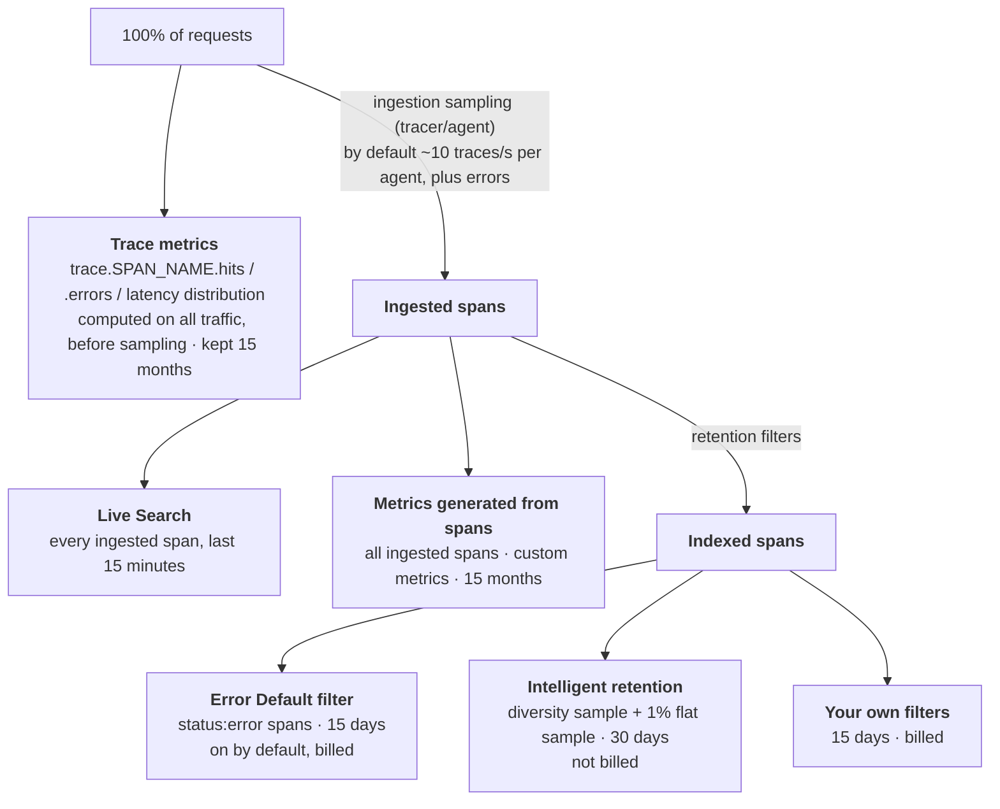

# APM trace enrichment

The auth service handles password login, OpenID/OAuth social login, one-time token (OTT) login, where the client polls until the user confirms, device login, and API keys for third-party integrations. The endpoint names below are this doc's; [flows.md](../../flows.md) uses its own simplified flows.

## Traces and wide events

- **Distributed tracing (APM)** captures a request's path across services as spans, with per-hop timing.
- **Wide events** capture all the context about a unit of work in one structured event ([events.md](../../events.md)).
- **They are the same idea.** A span with rich business tags *is* a wide event, with the per-hop timing on top. That's what this doc does: enrich the request's top-level span, then query it like a wide event.
- **The profiler is separate.** Datadog's Continuous Profiler (CPU and allocation profiles) is its own product, billed per host. Spans don't carry profiler data. Turning the profiler off cuts profiler cost, not APM cost (unless your plan bundles them, as APM Enterprise does).

## Cost model

- **Billing.** APM is billed per APM host, plus **ingested spans** (by GB) and **indexed spans** (by count, for a retention period). Details in [datadog.md](datadog.md#pricing).
- **No new metrics.** Custom tags on spans don't create custom metrics. They add a few bytes to every ingested span, so they're cheap even with high cardinality (`usr.id`).
- **Unless you turn them into metrics.** They only become custom metrics if you [generate metrics from spans](#metrics-generated-from-spans). Then cardinality matters again.
- **Exploring vs alerting.** Span tags are cheap for exploring the ingested and indexed spans, which are sampled. Trace metrics count all traffic but don't carry custom tags. To alert on a custom tag, use metrics generated from spans: they need a bounded tag and 100% of the service's spans ingested, because they aren't weighted by sample rate ([why](#metrics-generated-from-spans)).

## Tags we add



Set these on the request's **local root span**, the top-level span for the request in this service. Tagging whatever span is active might put them on a child span (a JDBC query, an HTTP client call), where request-level queries won't find them.



| Tag | Values | Notes |
|---|---|---|
| `platform` | `web`, `ios`, `android`, `desktop` | Fixed list. "Mobile" = `@platform:(ios OR android)`. |
| `api_key_id` | the key's ID | **Never the key itself** (see below). |
| `usr.id` | user ID | Datadog's standard user attribute. |

- **No raw keys.** Tags are visible to everyone with APM access, so a raw key there is a leaked credential.
- **Facets are optional.** You can search and group by any tag in Trace Explorer without setting anything up. Creating **facets** for `@platform`, `@api_key_id` and `@usr.id` adds them to the facet panel, so you can browse their values.

## Java implementation

The Datadog Java agent (`dd-java-agent`) creates the spans automatically. We only add tags. Datadog documents doing this through the OpenTracing API plus its own `MutableSpan` interface. OpenTracing itself is archived; if you're moving to OpenTelemetry, `Span.current().setAttribute(...)` is the equivalent, but it tags the current span, which may be a child.


```java
import datadog.trace.api.interceptor.MutableSpan;
import io.opentracing.Span;
import io.opentracing.util.GlobalTracer;

static void tagRequest(String platform, String apiKeyId, String userId) {
    Span active = GlobalTracer.get().activeSpan();
    if (active instanceof MutableSpan) {
        MutableSpan root = ((MutableSpan) active).getLocalRootSpan();
        root.setTag("platform", platform);
        root.setTag("api_key_id", apiKeyId);
        root.setTag("usr.id", userId);
    }
}
```


### Tomcat

- **Thread model**: synchronous, one thread per request.
- **Approach**: call `tagRequest` from a servlet filter or interceptor once you know the platform, key and user. The active span belongs to the current request because the agent keeps it per thread.
- **Async code**: servlet async processing, Spring `@Async` and `CompletableFuture` are instrumented too, so the request's span follows the work. The next section covers the cases that aren't.

### Netty and async code

- **Thread model**: asynchronous, event-loop-based. One thread serves many requests, so "the current thread's span" isn't a safe assumption in general.
- **What the agent handles**: `dd-java-agent` propagates the span context automatically across Netty handlers, `CompletableFuture`, Reactor, and `java.util.concurrent` executors (including custom `ThreadPoolExecutor` subclasses). Calling `tagRequest` from a handler or filter that runs for the request works as it does on Tomcat.
- **Netty promise listeners** are the exception among Netty's own APIs: propagation into them is off by default. Enable it with `-Ddd.integration.netty-promise.enabled=true`.
- **What you handle**: hand-offs the agent can't see, such as a hand-rolled `BlockingQueue` consumer, `new Thread(...)`, or a library with its own scheduler. Pass the span along with the work item and activate it on the other side:


```java
// import io.opentracing.Scope;
// producer, while the request's span is active
queue.put(new Job(payload, GlobalTracer.get().activeSpan()));

// consumer thread
Job job = queue.take();
try (Scope scope = GlobalTracer.get().activateSpan(job.span())) {
    // code here sees the request's span
}
```


## Troubleshooting with enriched traces

- **Syntax.** Queries use Trace Explorer syntax. Custom tags and span attributes take an `@` prefix (`@platform`, `@http.status_code`); reserved attributes (`service`, `resource_name`, `status`) and unified service tags (`env`, `version`) don't.
- **What counts as an error.** By default, Datadog marks server spans as errors for 5xx responses and for uncaught exceptions. 4xx responses (a wrong password, an expired token) are usually expected, so filter on `@http.status_code` when you want them. Client spans (our calls to other services) default to the opposite: 4xx is an error.



**Which spans a query can find.** For something happening right now, use **Live Search**, which covers every ingested span from the last 15 minutes. Older than that, you only find spans that a [retention filter](#what-datadog-keeps) kept. Error spans are kept by default. For non-error spans, only a sample is kept, so a query for one specific user or key might find few or none of their successful requests unless you add a retention filter for them.






| Question | Query | Then look at |
|---|---|---|
| A user reports an error: what happened? | `service:auth @usr.id:usr_456 status:error` | The trace: endpoint, platform, API key, timing, stack trace |
| Password login works but social login fails for one user? | `service:auth @usr.id:usr_456 resource_name:("POST /auth/password" OR "POST /auth/openid")` | Group by `resource_name` and `status`; compare the errors |
| Is a user stuck polling for an OTT? | `service:auth @usr.id:usr_456 resource_name:"GET /auth/ott/poll"` | Poll count and gaps over time; when polling started |




| Question | Query | Then look at |
|---|---|---|
| Is an API key integration failing? | `service:auth @api_key_id:key_xyz @http.status_code:>=400` | Group by `@error.type`, `resource_name`, `@platform` |
| A rate-limited key: legitimate or abuse? | `service:auth @api_key_id:key_xyz @http.status_code:429` | Request count over time; unique count of `@usr.id` (one user or many?); `@platform` |
| Is a key used from an unexpected platform? | `service:auth @api_key_id:web_key @platform:* -@platform:web` | Any hits: misconfiguration or a leaked credential |
| Which API keys have the slowest auth? | `service:auth @api_key_id:*` | p95 of `@duration` by `@api_key_id`, then by `@platform` for the worst keys |

- `@platform:*` skips spans with no platform tag.




| Question | Query | Then look at |
|---|---|---|
| Where does this exception come from? | `service:auth @error.type:java.lang.NullPointerException` | Group by `resource_name`; open a trace for the stack and the upstream calls |
| Why is social login slow on mobile, or Android slower than iOS? | `service:auth resource_name:"POST /auth/openid"` | p95 of `@duration` by `@platform` |
| Device login p99 is spiking: who's affected? | `service:auth resource_name:"POST /auth/device" @duration:>800ms` | Group by `@platform`, `@api_key_id`; unique count of `@usr.id` |
| Errors on one endpoint: a few users or many? | `service:auth resource_name:"POST /auth/password" @http.status_code:>=500` | Unique count of `@usr.id`: a few = account problem, many = service problem |
| Did the release break something? | `service:auth @http.status_code:>=500` | Group by `version`, and by `@platform` to see if one client is hit (e.g. iOS device login) |

- **Spans measure backend time only.** Client and network latency need RUM.
- **For error *rates* by version**, use [trace metrics](#trace-metrics), which count all traffic.




## Retention and metrics

### What Datadog keeps



- **Ingestion sampling** decides which traces reach Datadog at all. Configure it per service if you need more or fewer traces.
- **Retention filters** decide which ingested spans stay searchable.
  - The **Error Default** filter keeps error spans for 15 days.
  - **Intelligent retention** keeps a diversity sample for 30 days: at least one span per env, service, operation and resource, spans at the p75/p90/p95 latencies, representative errors, and a flat 1% of everything.
  - Add your own filter for what you must be able to find later and isn't an error, for example 100% of a flow you're investigating (`service:auth resource_name:"POST /auth/device"`). Remove it when you're done: indexed spans are billed.

### Trace metrics

Every instrumented service gets `trace.<span_name>.hits`, `.errors` and a latency distribution (for example `trace.servlet.request`).

- **All traffic.** They are computed from **all** traffic, before any sampling, kept for 15 months, and don't cost extra.
- **Fixed tags.** They're tagged by `env`, `service`, `version`, `resource_name`, `http.status_code`, `http.status_class`, host tags and a few configurable primary tags, but not by custom span tags.
- **Use them** for RED dashboards and SLOs.

### Metrics generated from spans

*Generate Metrics from Spans* computes metrics from ingested spans (before retention filters), with any span tag as a dimension. They're billed as **custom metrics** and kept for 15 months.

- **Use bounded tags only.** `platform` (4 values) is fine. `api_key_id` is fine if you have tens of keys, not thousands. **Never** `usr.id`: one series per user is exactly the cardinality explosion span tags avoid ([dashboards.md](../../dashboards.md#tagging-and-cardinality)).
- **They're computed on ingested spans, which are sampled.** Counts come out too low. Ratios are skewed too: the error sampler adds error traces on top of the normal sample, so error rates read high and latency percentiles shift. Trust span-based counts and ratios only when the service ingests 100% of its traffic. Otherwise use trace metrics for rates and latency, and span-based metrics for trends by custom tag.
- **Examples:**
  - Error rate by platform: spans with `status:error`, divided by all spans, grouped by `@platform`
  - Latency percentiles: distribution of `@duration`, grouped by `@platform`
  - Request volume: count of spans, grouped by `@platform` and `@api_key_id`
  - To see how many users are affected, use a unique count of `@usr.id` in Trace Explorer, not a metric.

### When to use each

| Need | Use | Retention |
|---|---|---|
| "Is the iOS error rate trending up?" RED dashboards, SLOs, capacity | Trace metrics; span-based metrics for custom tags | 15 months |
| "What's happening right now?" | Live Search | 15 minutes, all ingested spans |
| "Why did this request fail?" Stack traces, user reproduction | Indexed spans | 15 days (errors, custom filters); 30 days (intelligent retention sample) |

Alert on trace metrics, which count all traffic; find the cause in the spans, while they're still retained.
